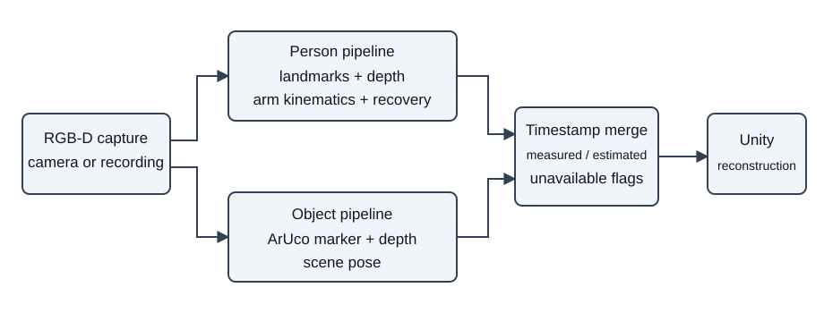

# Tracking and Reconstruction of Bi-Manual Object Handling Task Using RGB-D Sensing

One depth camera watches a person handling an object with both hands, and
this system rebuilds the person's arms and the object in a digital scene.
It records whether each joint was measured, estimated, or unavailable.
Body landmarks and depth feed a swing-twist arm model; ArUco markers locate
the object; timestamped streams feed a Unity reconstruction.

## System



## Versions

| Version | Purpose | Status | Documentation |
| --- | --- | --- | --- |
| v1 | Thesis pipeline and reference implementation | Frozen | [V1.md](v1/V1.md) |
| v2 | Shared frame broker and causal live merger | Active code; development paused; camera bring-up unverified | [README](v2/README.md) |
| v3 | Isolated detector and occlusion exploration | Exploratory; outside final thesis claims | [README](v3/README.md) |

## Key results

The results below are historical pinned measurements, not new release runs.

- On R7, one subject carrying the marked cube on the rail, the marker origin
  against the fitted rail line over 1,072 slide frames had median distance
  0.26 cm and p95 1.65 cm. This is a rail-line consistency measurement, not
  absolute 3D ground truth. [Report](eval/reports/r7_handover.md).
- On the pinned 899-frame recording, causal reconstruction compared with
  the offline reference at three frames lag had worst joint-group median
  error 0.64 deg and p95 3.24 deg. These measure agreement with that
  reference. [Pinned validation](v2/dataset/m3_validate_output.txt).
- The final thesis and defence are provided as [thesis PDF](writing/v9/Thesis_V9.pdf)
  and [DOCX](writing/v9/Thesis_V9.docx), [defence PPTX](presentation/defense_2026/Thesis_Defence_2026.pptx)
  and [PDF](presentation/defense_2026/Thesis_Defence_2026.pdf).
  [Speaker script](presentation/defense_2026/Thesis_Defence_2026_Speaker_Script.pdf),
  [outline and QA guide](presentation/defense_2026/Thesis_Defence_2026_Outline_and_QA_Index.pdf),
  and [committee questions](presentation/defense_2026/COMMITTEE_QUESTIONS.pdf)
  support review. Their inclusion and exact hashes are recorded in the
  [source manifest](release/source_manifest.jsonl).

## What this is NOT

This is a single-person, single-camera, rigid marked-object study. It does
not track fingers. Recovery has holding-context and visibility limits;
regrasping, free-arm occlusion and simultaneous marker loss remain limits.
The public snapshot includes scientific source and pinned evidence, but
excludes raw recordings, model weights and generated environments. Full
reproduction needs the original data and workstation dependencies.
[Reproduction limits](release/REPRODUCTION.md). The Unity character's
redistribution rights have not been established by this release.
[Credits and rights](release/THIRD_PARTY_NOTICES.md).

## Repository map

- `v1/`, `v2/`, `v3/`: reference pipeline, live transport and isolated exploration.
- `Unity/`: Assets, Packages and ProjectSettings for the reconstruction.
- `eval/`: calibration, labels, evaluation scripts, fixtures and pinned reports.
- `writing/`: final V9 dependencies plus archived source and figure inputs.
- `presentation/`: final defence, builders, media and measurement evidence.
- `thesis/`, `journal/`: mathematical write-ups and journal derivations.
- `knowledge/`, `research/`, `skill_set/`: scientific facts, literature and procedures.
- `scripts/`: Unity MCP startup utility.
- `.agent/`: scientific decisions and findings only.
- `Video/`: documented recording placeholder; no recording is distributed.
- `release/`: selection manifest, source accounting, verification and release notes.
- `ASSUMPTIONS.md`: scientific preconditions and scope.

## How to run it

The reviewer check needs Python 3 and its standard library. No install or
camera is needed. From this repository root:

```bash
python3 -B release/reviewer_smoke.py
```

It verifies source accounting, copied SHA-256 hashes and embedded defence
media, and prints the scope of the checks. For existing manuscript checks
and full pipeline prerequisites, use [REPRODUCTION.md](release/REPRODUCTION.md).
[Selection notes](release/SELECTION.md) explain omitted working material and
historical documentation links.
