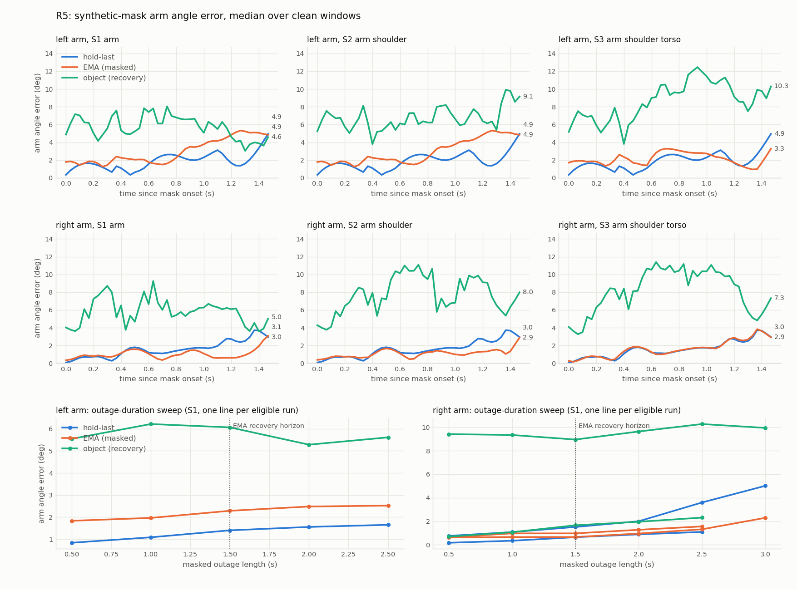

# R5 object-conditioned recovery: graded synthetic masking (recording_20260825_222315)

Graded evaluation of E-014 (object-conditioned wrist and elbow recovery) against the two recovery sources that precede it, under the standing E-013 rule: accuracy is measured only where the truth is known by construction.

## Headline

On R5 the object-conditioned recovery does NOT beat either baseline in any clean window, at any outage length up to 3 s. The report below identifies two independent causes, both measurable in the input rather than in the comparison: the grip offset is not constant inside a grip episode, and the clean windows put the arm at near-full extension, where the two-link elbow IK is singular.

## Why the windows are synthetic

On the frames where MediaPipe actually fails there is no independent measurement of the arm, so any accuracy number computed there compares two guesses. This harness therefore takes frames the failure detector calls GENUINELY TRACKED, records the unmasked solve as the reference, then removes the same landmarks the detector would have removed and scores each method against that reference. What the recovery must reproduce is known before the recovery runs.

## Constants

| constant | value | justification |
| --- | --- | --- |
| WIN | 45 | masked stretch, 1.5 s at 30 fps; equals the RobustChainSolver recovery horizon (occlusion_ext.py horizon=45), so the EMA baseline is scored over exactly the span it is allowed to act on |
| GUARD | 15 | unmasked frames between two windows of the same run, 0.50 s; the layer's 15 deg/frame slew limit absorbs up to 225 deg of re-lock inside that gap |
| MAX_WINDOWS | 8 | cap per side; R5 supplies far fewer |
| POST | 10 | re-acquisition horizon after the mask lifts, 0.33 s |
| ENTER_FRAMES | 5 | read from grip_state.py, not chosen here: a window may only start once the causal grip state machine could have entered the episode |
| DURATIONS | 15, 30, 45, 60, 75, 90 | supplementary sweep, bracketing the 45-frame EMA horizon on both sides |

## Window selection

A frame is eligible when ALL of the following hold.

1. The instantaneous grip classifier says this hand is on the object (carry.holding_mask: marker detected, object carried, wrist raw and within the pinned 25 cm hold radius of the box centre, forearm length plausible). The persisted grip STATE is not enough - it is designed to survive occlusion, and on otherwise clean frames it carries a hand out to 13.2 cm (left) and 34.9 cm (right) from the box centre, which is outside the technique's own premise.
2. No detector failure fires anywhere in the body (arm_L, arm_R or torso). A corrupt torso corrupts the root frame the arm angles are expressed in, so torso failures disqualify arm windows too.
3. The wrist sample is raw (wrist_flag 0), not filter-filled.
4. The object-derived wrist estimate exists.
5. The unmasked reference solve reports this side's swing and elbow groups LIVE.

The twist group is deliberately NOT required live: it is held by the E-012 straight-elbow observability rule, which is a property of the pose and not of the data. Twist frames stay in the windows, but their error elements are dropped wherever the reference twist is held. The same element-wise rule applies to the root columns.

A window may only START once the grip is ESTABLISHED - 5 consecutive clean-holding frames before it. Without that rule a window can open inside the state machine's entry delay, where the object estimate is absent for every masked frame and the object method silently degenerates into the EMA one. 3 of the eligible runs needed the shift: left run 1670-1760 starts at 1674, right run 656-748 starts at 661, right run 1669-1774 starts at 1674.

| quantity | left | right |
| --- | --- | --- |
| detector failure frames (arm) | 350 | 183 |
| detector failure frames (torso, shared) | 625 | 625 |
| holding frames (grip state) | 772 | 648 |
| grip episodes | 1014-1066, 1110-1828 | 656-756, 858-1066, 1110-1181, 1665-1930 |
| eligible frames | 154 | 304 |
| eligible runs of >= 45 frames | 1670-1760 | 656-748, 1669-1774 |
| windows carved | 1 | 2 |

R5's 625 torso-failure frames sit directly on top of the long left-hand grip episode (torso failure runs of 30 frames or more: 85-117, 896-931, 956-1130, 1182-1544), which is why the left side yields so few eligible frames despite the grip state calling it holding on 772.

### Windows

| side | frames | time (s) | grip episode | mu source | reference live: swing / twist / elbow / root |
| --- | --- | --- | --- | --- | --- |
| left | 1674-1718 | 55.84-57.31 | 1110-1828 | episode (366 clean) | 1.0 / 1.0 / 1.0 / 1.0 |
| right | 661-705 | 22.05-23.52 | 656-756 | episode (53 clean) | 1.0 / 0.0 / 1.0 / 1.0 |
| right | 1674-1718 | 55.84-57.31 | 1665-1930 | episode (102 clean) | 1.0 / 1.0 / 1.0 / 1.0 |

### What the windows contain

Descriptive statistics of the masked frames, computed from the measured landmarks and the object track. No method reads them; they exist to attribute the results below.

| side | frames | reference arm travel (deg) | wrist travel (cm) | wrist to box centre (cm) | grip drift vs episode mu (cm) | reach ratio, wrist distance over arm length | measured elbow bend (deg) |
| --- | --- | --- | --- | --- | --- | --- | --- |
| left | 1674-1718 | 21.16 | 12.57 | 6.52 | 13.09 | 0.847 (max 0.984) | 65.38 |
| right | 661-705 | 13.75 | 5.36 | 15.27 | 0.86 | 1.007 (max 1.024) | 21.57 |
| right | 1674-1718 | 27.71 | 13.46 | 18.07 | 12.86 | 0.91 (max 0.99) | 44.82 |

Grip drift is the distance between the window's own mean object-frame wrist offset and the episode mu the estimate is built from. Reach ratio is the measured shoulder-to-wrist distance divided by the calibrated upper arm plus forearm: at 1.0 the two-link IK circle collapses onto the shoulder-wrist axis and the elbow's swivel is unrecoverable no matter how good the wrist is.

## Scenarios

| scenario | landmarks taken from the solve over the window |
| --- | --- |
| S1_arm | the side's elbow and wrist are removed (extra_fail; the same frames are excluded from the grip-offset fit, so the scored frames never inform the estimate) |
| S2_arm_shoulder | S1 plus the side's shoulder nulled: the arm chain's anchor must itself be pair-recovered |
| S3_arm_shoulder_torso | S2 plus both hips nulled: the root frame has no support and must hold |

## Methods

| method | what it may use |
| --- | --- |
| hold-last | ChainFallbackSolver: the last valid angle |
| EMA (masked) | RobustChainSolver without the object input: gating plus EMA direction-memory recovery (the pre-E-014 layer) |
| object (recovery) | RobustChainSolver with the object input: wrist at the object-derived estimate, elbow by two-link IK |

## Metric scope

The primary number is the wrap-aware joint-angle error against the reference solve, pooled element-wise over all masked frames of all windows and over the five angle columns of the affected arm, keeping only elements whose reference group is live. Root columns are reported separately (they only move in S3). Wrist POSITION error is reported for the object method only, as |object-derived estimate - measured wrist| in the solver's point space: it is the geometric anchor the technique rests on and it is directly measurable. Hold and EMA place no wrist the eval can read without re-running forward kinematics, so no position number is quoted for them and the angle errors carry the comparison.

## Results

### S1_arm

| side | windows | method | angle err median (deg) | angle err p95 (deg) | worst-window median (deg) | root err median (deg) | re-acquisition max step (deg) |
| --- | --- | --- | --- | --- | --- | --- | --- |
| left | 1 | hold-last | 1.402 | 10.314 | 1.402 | 0.0 | 10.157 |
| left | 1 | EMA (masked) | 2.287 | 6.822 | 2.287 | 0.0 | 6.869 |
| left | 1 | object (recovery) | 6.064 | 15.098 | 6.064 | 0.0 | 15.0 |
| right | 2 | hold-last | 1.018 | 7.316 | 1.518 | 0.0 | 16.742 |
| right | 2 | EMA (masked) | 0.759 | 4.765 | 0.973 | 0.0 | 11.795 |
| right | 2 | object (recovery) | 3.057 | 24.559 | 8.947 | 0.0 | 15.0 |

| side | object wrist-estimate error median (cm) | p95 (cm) | worst window (frames) | worst-window object median (deg) |
| --- | --- | --- | --- | --- |
| left | 13.984 | 15.161 | 1674-1718 | 6.064 |
| right | 2.16 | 12.755 | 1674-1718 | 8.947 |

### S2_arm_shoulder

| side | windows | method | angle err median (deg) | angle err p95 (deg) | worst-window median (deg) | root err median (deg) | re-acquisition max step (deg) |
| --- | --- | --- | --- | --- | --- | --- | --- |
| left | 1 | hold-last | 1.402 | 10.314 | 1.402 | 0.0 | 10.157 |
| left | 1 | EMA (masked) | 2.287 | 6.822 | 2.287 | 0.0 | 6.869 |
| left | 1 | object (recovery) | 6.492 | 18.931 | 6.492 | 0.0 | 15.0 |
| right | 2 | hold-last | 1.018 | 7.316 | 1.518 | 0.12 | 16.742 |
| right | 2 | EMA (masked) | 0.828 | 4.154 | 0.896 | 0.01 | 10.417 |
| right | 2 | object (recovery) | 3.699 | 27.873 | 10.721 | 0.01 | 15.0 |

| side | object wrist-estimate error median (cm) | p95 (cm) | worst window (frames) | worst-window object median (deg) |
| --- | --- | --- | --- | --- |
| left | 13.984 | 15.161 | 1674-1718 | 6.492 |
| right | 2.16 | 12.755 | 1674-1718 | 10.721 |

### S3_arm_shoulder_torso

| side | windows | method | angle err median (deg) | angle err p95 (deg) | worst-window median (deg) | root err median (deg) | re-acquisition max step (deg) |
| --- | --- | --- | --- | --- | --- | --- | --- |
| left | 1 | hold-last | 1.402 | 10.314 | 1.402 | 0.693 | 10.157 |
| left | 1 | EMA (masked) | 2.068 | 11.769 | 2.068 | 0.693 | 11.611 |
| left | 1 | object (recovery) | 8.311 | 22.403 | 8.311 | 0.693 | 15.0 |
| right | 2 | hold-last | 1.018 | 7.316 | 1.518 | 0.617 | 16.742 |
| right | 2 | EMA (masked) | 1.134 | 7.602 | 1.472 | 0.617 | 15.0 |
| right | 2 | object (recovery) | 3.803 | 35.526 | 12.015 | 0.617 | 15.0 |

| side | object wrist-estimate error median (cm) | p95 (cm) | worst window (frames) | worst-window object median (deg) |
| --- | --- | --- | --- | --- |
| left | 13.984 | 15.161 | 1674-1718 | 8.311 |
| right | 2.16 | 12.755 | 1674-1718 | 12.015 |

### Where the object method's error sits (S1, per window)

| side | window | method | swing median (deg) | twist median (deg) | elbow median (deg) | object wrist error median (cm) |
| --- | --- | --- | --- | --- | --- | --- |
| left | 1674-1718 | hold-last | 1.356 | 8.226 | 0.056 |  |
| left | 1674-1718 | EMA (masked) | 2.534 | 5.705 | 0.007 |  |
| left | 1674-1718 | object (recovery) | 9.896 | 4.425 | 0.252 | 13.984 |
| right | 661-705 | hold-last | 1.327 |  | 0.011 |  |
| right | 661-705 | EMA (masked) | 1.954 |  | 0.0 |  |
| right | 661-705 | object (recovery) | 1.954 |  | 0.071 | 1.182 |
| right | 1674-1718 | hold-last | 1.911 | 6.728 | 0.037 |  |
| right | 1674-1718 | EMA (masked) | 0.551 | 2.421 | 0.003 |  |
| right | 1674-1718 | object (recovery) | 12.928 | 6.67 | 1.338 | 6.874 |

## Outage-duration sweep (supplementary, S1 only)

One window per eligible run, anchored at that run's established start, masked for each duration in turn. This is the test the fixed 45-frame window cannot answer: 45 frames is exactly the EMA recovery horizon, so the EMA baseline is measured at its strongest.

| side | window | outage (frames) | outage (s) | hold-last median (deg) | EMA (masked) median (deg) | object (recovery) median (deg) | object wrist error median (cm) |
| --- | --- | --- | --- | --- | --- | --- | --- |
| left | 1674-1688 | 15 | 0.5 | 0.839 | 1.834 | 5.544 | 13.701 |
| left | 1674-1703 | 30 | 1.0 | 1.086 | 1.964 | 6.215 | 13.834 |
| left | 1674-1718 | 45 | 1.5 | 1.402 | 2.287 | 6.064 | 13.984 |
| left | 1674-1733 | 60 | 2.0 | 1.556 | 2.48 | 5.281 | 14.216 |
| left | 1674-1748 | 75 | 2.5 | 1.652 | 2.522 | 5.612 | 14.813 |
| right | 661-675 | 15 | 0.5 | 0.175 | 0.637 | 0.697 | 1.291 |
| right | 661-690 | 30 | 1.0 | 0.348 | 0.973 | 1.073 | 1.089 |
| right | 661-705 | 45 | 1.5 | 0.647 | 0.973 | 1.661 | 1.182 |
| right | 661-720 | 60 | 2.0 | 0.889 | 1.279 | 1.961 | 1.27 |
| right | 661-735 | 75 | 2.5 | 1.097 | 1.564 | 2.314 | 1.265 |
| right | 1674-1688 | 15 | 0.5 | 0.76 | 0.624 | 9.41 | 3.876 |
| right | 1674-1703 | 30 | 1.0 | 1.082 | 0.661 | 9.335 | 4.809 |
| right | 1674-1718 | 45 | 1.5 | 1.518 | 0.664 | 8.947 | 6.874 |
| right | 1674-1733 | 60 | 2.0 | 2.002 | 0.959 | 9.631 | 7.588 |
| right | 1674-1748 | 75 | 2.5 | 3.598 | 1.319 | 10.266 | 12.546 |
| right | 1674-1763 | 90 | 3.0 | 5.013 | 2.293 | 9.939 | 13.229 |

Top two rows: median across windows of the per-frame arm angle error against time since the mask began. Bottom row: the duration sweep, with the EMA recovery horizon marked.

## Honesty check

During a masked window every joint group that consumed a removed or nulled landmark must report its live bit CLEAR, for all three methods (S3 additionally requires the root bit clear).

PASS: 0 violations over 9 window-scenario runs, all three methods.

## Interpretation

The object-conditioned recovery is beaten by both baselines in every window and at every outage length R5 admits: pooled over S1 it costs several degrees of median arm error where hold-last and the EMA layer stay near one, and the duration sweep shows no crossover inside 3 s. The object path's error does not decay with outage length the way a memory's does - it is a bias, flat in time - so the ranking is set by how large that bias is, not by how long the outage lasts.

The bias has two separable sources, and the second is the surprise. The first is grip-offset drift: the per-episode mu is fitted over a whole grip episode, and R5's episodes are long (the longest runs 1110 to 1828, 24 s) with the operator regrasping inside them, so the window's real offset sits up to 13.09 cm from the episode mu (2 of the 3 windows sit at 12.86 cm or more) and the object-derived wrist inherits exactly that error. The second source is independent of the grip: in window right 661-705 the object wrist estimate is accurate to 1.182 cm, and the method is still 1.661 deg wrong, because the arm sits at a reach ratio of 1.007 - beyond the calibrated arm length - so the two-link IK clips its cosine, collapses the intersection circle onto the shoulder-wrist axis, and returns a straight arm where the operator's elbow is bent 21.57 deg. Every clean window on R5 sits at a reach ratio of 0.847 or more, which is what holding a box in front of the body looks like, so this is the normal case for the task rather than an edge case.

The baselines win here for a reason that also bounds how far this result generalises: a window that satisfies the E-013 cleanliness rule is a window in which the hand is quietly holding the box, and the reference arm travels only 13.75 to 27.71 deg across 1.5 s. Hold-last is close to correct by construction on such frames, and the EMA memory is fresh. What the harness therefore establishes is narrower than a verdict on the technique: on quasi-static holding, the object anchor's bias exceeds what a memory loses, and before the technique can win anywhere the mu must be re-estimated inside an episode and the elbow IK must refuse to answer near full extension instead of returning a straight arm.

Two secondary observations. S3 behaves as designed: with both hips nulled the root bit is clear on every masked frame for all three methods and the root simply holds, and because the R5 root moves little over 1.5 s the root error stays small - the scenario shows the arm chain survives on a pair-recovered shoulder, not that the root is accurate. Re-acquisition is bounded at the layer's 15 deg/frame slew limit for the EMA and object methods, while hold-last has no limiter and is only smooth here because it was never far away.

## Limitations

- Windows exist only where the hand demonstrably held the object and the clean condition (both arms + torso) held. On R5 that is 458 frames out of 2099, carving 3 windows. The sample is windows, not hours: each aggregate pools 1 left and 2 right windows, so a single window moves it.
- The technique's accuracy is bounded by the grip-offset variance: the object-derived wrist is the object pose plus a per-episode constant, so within-episode regrasping enters the result directly. The per-window mu source, its clean-frame count, and the measured drift are tabulated above so the bound is visible rather than assumed.
- The reference is the unmasked robust solve, not external motion capture. It is measurement-determined on exactly the elements scored (that is what the liveness requirement buys), but it inherits the extractor's own noise, so differences of a few tenths of a degree between methods are not meaningful.
- Hold-last is the only method without the layer's 15 deg/frame slew limit, so its re-acquisition step is not bounded by construction while the other two are. Read that column as a property of the layer as much as of the recovery source.
- The reference run applies no failure mask at all, while all three methods run with the detector mask applied everywhere, so their solver states diverge outside the windows. Inside a window the reference is a live measurement, so the comparison is against data, but each method enters a window with its own history.
- The duration sweep uses one window per run and cannot exceed what a run allows, so 90 frames is measured on a single right-arm window. It bounds the trend, it does not establish a crossover point.

