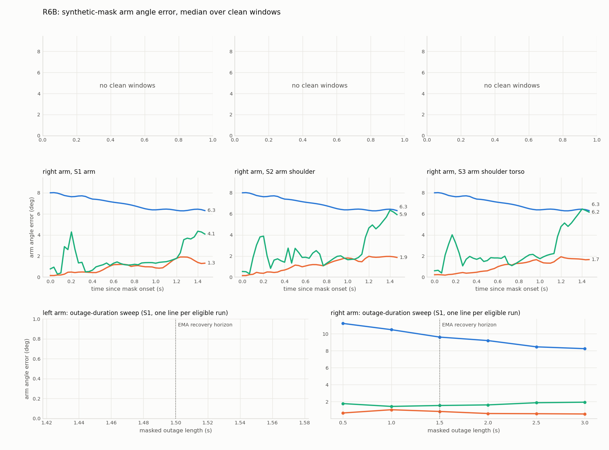

# R6B object-conditioned recovery: graded synthetic masking (recording_20260831_065553)

Graded evaluation of E-014 (object-conditioned wrist and elbow recovery) against the two recovery sources that precede it, under the standing E-013 rule: accuracy is measured only where the truth is known by construction.

## Headline

R6B: right arm, 5 windows, S1: pooled angle-error medians hold-last 3.397, EMA 0.595, object 1.33 deg; object wrist-estimate error median 1.02 cm (p95 2.882). Clean condition: evaluated side + torso (E-025). The R5-specific interpretation sections are omitted for this recording; the tables below carry the numbers.

## Why the windows are synthetic

On the frames where MediaPipe actually fails there is no independent measurement of the arm, so any accuracy number computed there compares two guesses. This harness therefore takes frames the failure detector calls GENUINELY TRACKED, records the unmasked solve as the reference, then removes the same landmarks the detector would have removed and scores each method against that reference. What the recovery must reproduce is known before the recovery runs.

## Constants

| constant | value | justification |
| --- | --- | --- |
| WIN | 45 | masked stretch, 1.5 s at 30 fps; equals the RobustChainSolver recovery horizon (occlusion_ext.py horizon=45), so the EMA baseline is scored over exactly the span it is allowed to act on |
| GUARD | 15 | unmasked frames between two windows of the same run, 0.50 s; the layer's 15 deg/frame slew limit absorbs up to 225 deg of re-lock inside that gap |
| MAX_WINDOWS | 8 | cap per side; R5 supplies far fewer |
| POST | 10 | re-acquisition horizon after the mask lifts, 0.33 s |
| ENTER_FRAMES | 5 | read from grip_state.py, not chosen here: a window may only start once the causal grip state machine could have entered the episode |
| DURATIONS | 15, 30, 45, 60, 75, 90 | supplementary sweep, bracketing the 45-frame EMA horizon on both sides |

## Window selection

A frame is eligible when ALL of the following hold.

1. The instantaneous grip classifier says this hand is on the object (carry.holding_mask: marker detected, object carried, wrist raw and within the pinned 25 cm hold radius of the box centre, forearm length plausible). The persisted grip STATE is not enough - it is designed to survive occlusion, and on otherwise clean frames it carries a hand out to None cm (left) and None cm (right) from the box centre, which is outside the technique's own premise.
2. No detector failure fires anywhere in the body (arm_L, arm_R or torso). A corrupt torso corrupts the root frame the arm angles are expressed in, so torso failures disqualify arm windows too.
3. The wrist sample is raw (wrist_flag 0), not filter-filled.
4. The object-derived wrist estimate exists.
5. The unmasked reference solve reports this side's swing and elbow groups LIVE.

The twist group is deliberately NOT required live: it is held by the E-012 straight-elbow observability rule, which is a property of the pose and not of the data. Twist frames stay in the windows, but their error elements are dropped wherever the reference twist is held. The same element-wise rule applies to the root columns.

A window may only START once the grip is ESTABLISHED - 5 consecutive clean-holding frames before it. Without that rule a window can open inside the state machine's entry delay, where the object estimate is absent for every masked frame and the object method silently degenerates into the EMA one. 1 of the eligible runs needed the shift: right run 207-536 starts at 212.

| quantity | left | right |
| --- | --- | --- |
| detector failure frames (arm) | 838 | 119 |
| detector failure frames (torso, shared) | 280 | 280 |
| holding frames (grip state) | 0 | 682 |
| grip episodes |  | 207-888 |
| eligible frames | 0 | 342 |
| eligible runs of >= 45 frames | none | 207-536 |
| windows carved | 0 | 5 |

Torso failure runs of 30 frames or more: 632-899. Clean condition: evaluated side + torso (E-025).

### Windows

| side | frames | time (s) | grip episode | mu source | reference live: swing / twist / elbow / root |
| --- | --- | --- | --- | --- | --- |
| right | 212-256 | 7.07-8.54 | 207-888 | episode (532 clean) | 1.0 / 0.0 / 1.0 / 0.0 |
| right | 272-316 | 9.07-10.54 | 207-888 | episode (532 clean) | 1.0 / 0.0 / 1.0 / 0.0 |
| right | 332-376 | 11.07-12.54 | 207-888 | episode (532 clean) | 1.0 / 0.0 / 1.0 / 0.0 |
| right | 392-436 | 13.08-14.54 | 207-888 | episode (532 clean) | 1.0 / 0.0 / 1.0 / 0.0 |
| right | 452-496 | 15.08-16.54 | 207-888 | episode (532 clean) | 1.0 / 0.0 / 1.0 / 0.0 |

### What the windows contain

Descriptive statistics of the masked frames, computed from the measured landmarks and the object track. No method reads them; they exist to attribute the results below.

| side | frames | reference arm travel (deg) | wrist travel (cm) | wrist to box centre (cm) | grip drift vs episode mu (cm) | reach ratio, wrist distance over arm length | measured elbow bend (deg) |
| --- | --- | --- | --- | --- | --- | --- | --- |
| right | 212-256 | 7.81 | 4.4 | 9.14 | 4.31 | 0.991 (max 0.997) | 14.67 |
| right | 272-316 | 7.03 | 4.03 | 8.42 | 4.08 | 0.988 (max 0.995) | 13.81 |
| right | 332-376 | 7.79 | 4.31 | 7.92 | 3.45 | 1.003 (max 1.012) | 14.42 |
| right | 392-436 | 12.64 | 5.25 | 6.84 | 4.33 | 0.99 (max 1.006) | 17.02 |
| right | 452-496 | 11.52 | 2.51 | 6.85 | 4.04 | 0.997 (max 1.004) | 17.39 |

Grip drift is the distance between the window's own mean object-frame wrist offset and the episode mu the estimate is built from. Reach ratio is the measured shoulder-to-wrist distance divided by the calibrated upper arm plus forearm: at 1.0 the two-link IK circle collapses onto the shoulder-wrist axis and the elbow's swivel is unrecoverable no matter how good the wrist is.

## Scenarios

| scenario | landmarks taken from the solve over the window |
| --- | --- |
| S1_arm | the side's elbow and wrist are removed (extra_fail; the same frames are excluded from the grip-offset fit, so the scored frames never inform the estimate) |
| S2_arm_shoulder | S1 plus the side's shoulder nulled: the arm chain's anchor must itself be pair-recovered |
| S3_arm_shoulder_torso | S2 plus both hips nulled: the root frame has no support and must hold |

## Methods

| method | what it may use |
| --- | --- |
| hold-last | ChainFallbackSolver: the last valid angle |
| EMA (masked) | RobustChainSolver without the object input: gating plus EMA direction-memory recovery (the pre-E-014 layer) |
| object (recovery) | RobustChainSolver with the object input: wrist at the object-derived estimate, elbow by two-link IK |

## Metric scope

The primary number is the wrap-aware joint-angle error against the reference solve, pooled element-wise over all masked frames of all windows and over the five angle columns of the affected arm, keeping only elements whose reference group is live. Root columns are reported separately (they only move in S3). Wrist POSITION error is reported for the object method only, as |object-derived estimate - measured wrist| in the solver's point space: it is the geometric anchor the technique rests on and it is directly measurable. Hold and EMA place no wrist the eval can read without re-running forward kinematics, so no position number is quoted for them and the angle errors carry the comparison.

## Results

### S1_arm

| side | windows | method | angle err median (deg) | angle err p95 (deg) | worst-window median (deg) | root err median (deg) | re-acquisition max step (deg) |
| --- | --- | --- | --- | --- | --- | --- | --- |
| right | 5 | hold-last | 3.397 | 92.637 | 9.611 |  | 51.352 |
| right | 5 | EMA (masked) | 0.595 | 5.571 | 2.101 |  | 8.46 |
| right | 5 | object (recovery) | 1.33 | 9.086 | 1.938 |  | 15.0 |

| side | object wrist-estimate error median (cm) | p95 (cm) | worst window (frames) | worst-window object median (deg) |
| --- | --- | --- | --- | --- |
| right | 1.02 | 2.882 | 392-436 | 1.938 |

### S2_arm_shoulder

| side | windows | method | angle err median (deg) | angle err p95 (deg) | worst-window median (deg) | root err median (deg) | re-acquisition max step (deg) |
| --- | --- | --- | --- | --- | --- | --- | --- |
| right | 5 | hold-last | 3.397 | 92.637 | 9.611 |  | 51.352 |
| right | 5 | EMA (masked) | 0.778 | 5.285 | 1.85 |  | 9.884 |
| right | 5 | object (recovery) | 1.822 | 20.51 | 5.947 |  | 15.0 |

| side | object wrist-estimate error median (cm) | p95 (cm) | worst window (frames) | worst-window object median (deg) |
| --- | --- | --- | --- | --- |
| right | 1.02 | 2.882 | 332-376 | 5.947 |

### S3_arm_shoulder_torso

| side | windows | method | angle err median (deg) | angle err p95 (deg) | worst-window median (deg) | root err median (deg) | re-acquisition max step (deg) |
| --- | --- | --- | --- | --- | --- | --- | --- |
| right | 5 | hold-last | 3.397 | 92.637 | 9.611 |  | 51.352 |
| right | 5 | EMA (masked) | 0.719 | 5.099 | 2.056 |  | 8.941 |
| right | 5 | object (recovery) | 1.93 | 20.267 | 5.079 |  | 15.0 |

| side | object wrist-estimate error median (cm) | p95 (cm) | worst window (frames) | worst-window object median (deg) |
| --- | --- | --- | --- | --- |
| right | 1.02 | 2.882 | 332-376 | 5.079 |

### Where the object method's error sits (S1, per window)

| side | window | method | swing median (deg) | twist median (deg) | elbow median (deg) | object wrist error median (cm) |
| --- | --- | --- | --- | --- | --- | --- |
| right | 212-256 | hold-last | 24.645 |  | 0.019 |  |
| right | 212-256 | EMA (masked) | 1.312 |  | 0.03 |  |
| right | 212-256 | object (recovery) | 1.558 |  | 0.731 | 0.518 |
| right | 272-316 | hold-last | 31.138 |  | 0.004 |  |
| right | 272-316 | EMA (masked) | 0.304 |  | 0.018 |  |
| right | 272-316 | object (recovery) | 0.475 |  | 0.332 | 0.993 |
| right | 332-376 | hold-last | 34.351 |  | 0.0 |  |
| right | 332-376 | EMA (masked) | 1.489 |  | 0.137 |  |
| right | 332-376 | object (recovery) | 1.919 |  | 0.977 | 1.214 |
| right | 392-436 | hold-last | 47.589 |  | 0.067 |  |
| right | 392-436 | EMA (masked) | 2.497 |  | 0.045 |  |
| right | 392-436 | object (recovery) | 3.117 |  | 0.01 | 2.549 |
| right | 452-496 | hold-last | 48.466 |  | 0.03 |  |
| right | 452-496 | EMA (masked) | 0.766 |  | 0.037 |  |
| right | 452-496 | object (recovery) | 0.766 |  | 0.014 | 0.926 |

## Outage-duration sweep (supplementary, S1 only)

One window per eligible run, anchored at that run's established start, masked for each duration in turn. This is the test the fixed 45-frame window cannot answer: 45 frames is exactly the EMA recovery horizon, so the EMA baseline is measured at its strongest.

| side | window | outage (frames) | outage (s) | hold-last median (deg) | EMA (masked) median (deg) | object (recovery) median (deg) | object wrist error median (cm) |
| --- | --- | --- | --- | --- | --- | --- | --- |
| right | 212-226 | 15 | 0.5 | 11.223 | 0.662 | 1.769 | 0.542 |
| right | 212-241 | 30 | 1.0 | 10.487 | 1.044 | 1.436 | 0.546 |
| right | 212-256 | 45 | 1.5 | 9.611 | 0.841 | 1.544 | 0.518 |
| right | 212-271 | 60 | 2.0 | 9.199 | 0.598 | 1.615 | 0.555 |
| right | 212-286 | 75 | 2.5 | 8.462 | 0.575 | 1.87 | 0.676 |
| right | 212-301 | 90 | 3.0 | 8.246 | 0.544 | 1.933 | 0.822 |

Top two rows: median across windows of the per-frame arm angle error against time since the mask began. Bottom row: the duration sweep, with the EMA recovery horizon marked.

## Honesty check

During a masked window every joint group that consumed a removed or nulled landmark must report its live bit CLEAR, for all three methods (S3 additionally requires the root bit clear).

PASS: 0 violations over 15 window-scenario runs, all three methods.

## Interpretation

Omitted: the interpretation above was written for R5. For this recording read the tables; the moving-window check (moving_window_check.py) reports the forward-kinematics wrist error the reconstruction shows.

## Limitations

- Windows exist only where the hand demonstrably held the object and the clean condition (evaluated side + torso (E-025)) held. On R6B that is 342 frames out of 900, carving 5 windows. The sample is windows, not hours: each aggregate pools 0 left and 5 right windows, so a single window moves it.
- The technique's accuracy is bounded by the grip-offset variance: the object-derived wrist is the object pose plus a per-episode constant, so within-episode regrasping enters the result directly. The per-window mu source, its clean-frame count, and the measured drift are tabulated above so the bound is visible rather than assumed.
- The reference is the unmasked robust solve, not external motion capture. It is measurement-determined on exactly the elements scored (that is what the liveness requirement buys), but it inherits the extractor's own noise, so differences of a few tenths of a degree between methods are not meaningful.
- Hold-last is the only method without the layer's 15 deg/frame slew limit, so its re-acquisition step is not bounded by construction while the other two are. Read that column as a property of the layer as much as of the recovery source.
- The reference run applies no failure mask at all, while all three methods run with the detector mask applied everywhere, so their solver states diverge outside the windows. Inside a window the reference is a live measurement, so the comparison is against data, but each method enters a window with its own history.
- The duration sweep uses one window per run and cannot exceed what a run allows, so 90 frames is measured on a single right-arm window. It bounds the trend, it does not establish a crossover point.

