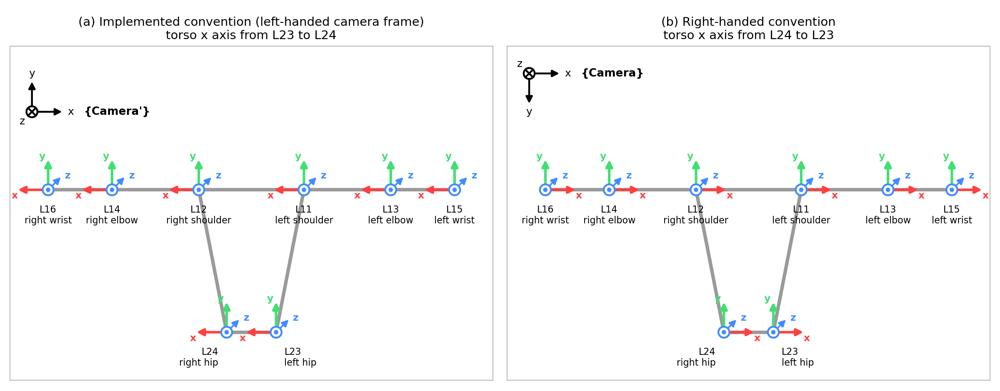
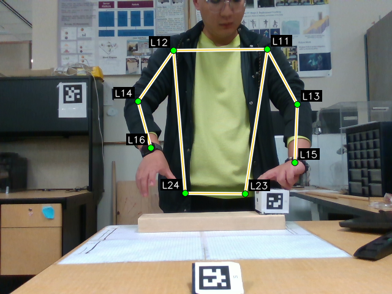
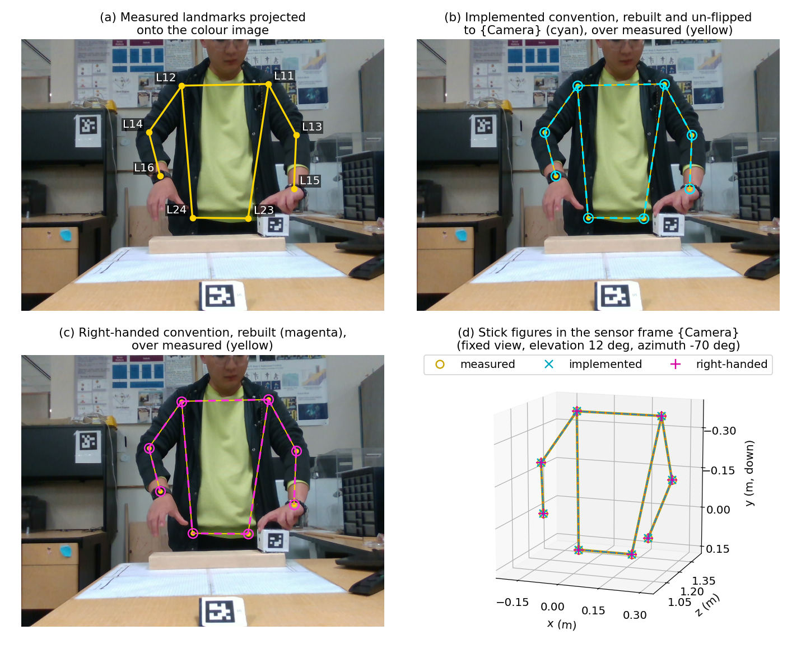

# Joint angles from eight body landmarks in two frame conventions

Lanqing Luo, 8 October 2026.

## 1. Introduction

### 1.1 Purpose

The tracking pipeline of the thesis [1] converts eight body landmarks measured by a depth camera into thirteen joint angles of a torso-and-arms skeleton: three for the orientation of the torso, three for each shoulder and two for each elbow. The angles drive an avatar in Unity, a game engine whose coordinate frame is left-handed, and for that reason the pipeline builds its torso frame in a left-handed camera frame. This note derives the thirteen angles twice, from the same landmarks of one recorded frame: Section 2 in the convention that is implemented, and Section 3 in a right-handed convention that keeps the sensor frame of the camera unchanged. Each section is self-contained and ends with a forward-kinematics check in which its angles rebuild the eight landmarks. Section 4 compares the two sets of angles, proves how they are related and states what the choice between the conventions depends on. The derivation is meant to support a decision on which convention the pipeline should use when its angles are consumed by right-handed tools, such as robotics and biomechanics software.

### 1.2 The landmarks and the sensor frame

The skeleton uses eight of the 33 pose landmarks that the MediaPipe Pose estimator returns for a person: the two shoulders, the two elbows, the two wrists and the two hips. They are named by the estimator's landmark indices, which Figure 1 shows on an ideal T-pose: L11 left shoulder, L12 right shoulder, L13 left elbow, L14 right elbow, L15 left wrist, L16 right wrist, L23 left hip and L24 right hip. Left and right are the subject's own. The subject faces the camera, so the subject's right side appears on the left of the image.

Figure 1. The torso frame of each convention drawn on an ideal T-pose at the eight landmarks. The view is the image plane as the camera sees it: page right is camera $+x$ and page down is camera $+y$. Panel (a) is the implemented convention of Section 2, whose frames are built in the left-handed frame {Camera'} with the torso $x$ axis pointing from L23 to L24. Panel (b) is the right-handed convention of Section 3, whose frames are built in the sensor frame {Camera} with the torso $x$ axis pointing from L24 to L23. Axis colours are $x$ red, $y$ green and $z$ blue. A circled dot is an axis pointing out of the page toward the viewer, and a circled cross is an axis pointing into the page. The same triad is drawn at all eight landmarks because at rest every frame of the chain has the orientation of the torso frame. The small glyph in the corner of each panel is the camera frame of that panel.

{Camera} is the sensor frame of the depth camera: $x$ points to the right of the image, $y$ down the image and $z$ forward along the optical axis into the scene. It is right-handed, $(1,0,0)^T \times (0,1,0)^T = (0,0,1)^T$. All measured positions are delivered in this frame, in metres.

### 1.3 Notation and the thirteen angles

Frames, rotations and positions are written in the notation of Craig, as in Chapter 3 of the thesis [1]. A frame is written in braces, {Camera}, {L24}. A rotation ${}^{A}_{B}R$ carries the reference frame $A$ as a leading superscript and the described frame $B$ as a leading subscript. Its columns are the axis directions of $B$ expressed in $A$,

$$
{}^{A}_{B}R = \begin{pmatrix} {}^{A}\hat{X}_{B} & {}^{A}\hat{Y}_{B} & {}^{A}\hat{Z}_{B} \end{pmatrix},
\tag{1.1}
$$

so that a vector with components ${}^{B}v$ in $B$ has components ${}^{A}v$ in $A$ given by

$$
{}^{A}v = {}^{A}_{B}R\,{}^{B}v, \qquad {}^{B}v = \left({}^{A}_{B}R\right)^{T}{}^{A}v,
$$

the second form because a rotation matrix is orthogonal. A position vector of landmark $k$ expressed in frame $A$ is ${}^{A}P_{k}$, and ${}^{A}P_{B\mathrm{ORG}}$ is the origin of frame $B$ expressed in $A$. The letters $A$ and $B$ stand for any two frames. The chain frames of Section 2 are named after the landmark at their origin, {L24}, {L12}, {L14}, {L11}, {L13}. Section 3 builds a different frame at each of the same five landmarks, and those frames carry a star, {L24*}, {L12*}, {L14*}, {L11*}, {L13*}, so that the two conventions can appear in one equation in Section 4. Where a scalar or a column of a matrix has to be tagged with its convention there, the implemented convention carries the mark lh (left-handed) and the right-handed convention the mark rh.

A hat marks a unit vector, $\hat{v} = v / \lVert v \rVert$ with $\lVert v \rVert = \sqrt{v_x^2 + v_y^2 + v_z^2}$. The cross product of $a = (a_x, a_y, a_z)^T$ and $b = (b_x, b_y, b_z)^T$ is

$$
a \times b = \begin{pmatrix} a_y b_z - a_z b_y \\ a_z b_x - a_x b_z \\ a_x b_y - a_y b_x \end{pmatrix}.
\tag{1.2}
$$

The three elementary rotations about the coordinate axes, which act on coordinate vectors and carry no frame pair, are

$$
R_x(\alpha) = \begin{pmatrix} 1 & 0 & 0 \\ 0 & \cos\alpha & -\sin\alpha \\ 0 & \sin\alpha & \cos\alpha \end{pmatrix}, \quad
R_y(\alpha) = \begin{pmatrix} \cos\alpha & 0 & \sin\alpha \\ 0 & 1 & 0 \\ -\sin\alpha & 0 & \cos\alpha \end{pmatrix}, \quad
R_z(\alpha) = \begin{pmatrix} \cos\alpha & -\sin\alpha & 0 \\ \sin\alpha & \cos\alpha & 0 \\ 0 & 0 & 1 \end{pmatrix}.
\tag{1.3}
$$

The thirteen angles are, in the order in which the pipeline emits them: the torso pitch $\theta_x$ about the lateral axis of the torso, the torso yaw $\theta_y$ about its vertical axis and the torso roll $\theta_z$ about its forward axis, then for the right arm the shoulder azimuth $t_y$, elevation $t_z$ and twist $t_t$ and the elbow flexion $e_y$ and out-of-plane angle $e_z$, then the same five for the left arm. The wrists L16 and L15 are tracked points, not frames, because the orientation of the hand is not observable from these landmarks. At rest, with all joint angles zero, every frame of the chain has the orientation of the torso frame and only its origin moves to its own landmark. The out-of-plane elbow angle is carried as a slot because the elbow rotation has the general swing form $R_y(e_y)\,R_z(e_z)$, and Sections 2.5 and 3.5 show that the slot is always zero.

The torso orientation is encoded by the three torso angles applied about the parent-frame axes in the order $z$, then $x$, then $y$:

$$
R = R_y(\theta_y)\,R_x(\theta_x)\,R_z(\theta_z) =
\begin{pmatrix}
c_y c_z + s_y s_x s_z & -c_y s_z + s_y s_x c_z & s_y c_x \\
c_x s_z & c_x c_z & -s_x \\
-s_y c_z + c_y s_x s_z & s_y s_z + c_y s_x c_z & c_y c_x
\end{pmatrix},
\tag{1.4}
$$

with $c_x = \cos\theta_x$, $s_x = \sin\theta_x$ and likewise for $y$ and $z$. Writing $m_{ij}$ for the entry in row $i$ and column $j$ of a measured torso matrix, the angles are read from the five entries that contain a single product:

$$
\theta_x = \mathrm{asin}(-m_{23}), \qquad
\theta_y = \mathrm{atan2}(m_{13},\, m_{33}), \qquad
\theta_z = \mathrm{atan2}(m_{21},\, m_{22}).
\tag{1.5}
$$

The arcsine returns $\theta_x$ in $[-90^\circ, 90^\circ]$, so $c_x \ge 0$ and the two arctangents are unambiguous unless $|m_{23}| = 1$. A rigid transformation between two frames is the four-by-four matrix of the rotation and the origin,

$$
{}^{A}_{B}T = \begin{pmatrix} {}^{A}_{B}R & {}^{A}P_{B\mathrm{ORG}} \\ 0 & 1 \end{pmatrix}, \qquad
\begin{pmatrix} {}^{A}P_{k} \\ 1 \end{pmatrix} = {}^{A}_{B}T \begin{pmatrix} {}^{B}P_{k} \\ 1 \end{pmatrix},
\tag{1.6}
$$

and transformations chain by matrix product, the shared frame label cancelling. Numbers are printed to six decimals, radians to eight, from double-precision arithmetic, so the last printed digit of a result can differ by one unit from what the printed operands give.

### 1.4 The worked-example frame

The worked example is one frame of a recording, made with the depth camera on 8 September 2026, of a person handing an object across a desk while facing the camera (Figure 2). The frame was chosen because all eight landmarks are clearly visible and the depth reading at each landmark pixel lies on the body. The positions below are those of this single frame, with no filtering.

Figure 2. The colour image of the worked-example frame with the eight landmarks and the segments between them.

The pose estimator returns each landmark as a position in the 640 by 480 image. The pipeline takes the integer pixel $(u, v)$ of the landmark, reads its depth $d$ in metres from the aligned depth image as the median of the 5 by 5 pixel window centred on the pixel, and deprojects the pixel with the pinhole model

$$
{}^{\mathrm{Camera}}P_{k} =
\begin{pmatrix}
\dfrac{u - c_x}{f_x}\, d \\[2mm]
\dfrac{v - c_y}{f_y}\, d \\[2mm]
d
\end{pmatrix},
\qquad
f_x = 607.561279,\ f_y = 607.015076,\ c_x = 323.937561,\ c_y = 248.017410.
\tag{1.7}
$$

The intrinsics are those of the colour stream of the recording, in pixels, and its distortion coefficients are all zero. Table 1 lists the result.

| Landmark | $u$ (px) | $v$ (px) | $d$ (m) | $x$ (m) | $y$ (m) | $z$ (m) |
| --- | --- | --- | --- | --- | --- | --- |
| L11 left shoulder | 436 | 79 | 1.309 | +0.241440 | -0.364478 | +1.309000 |
| L12 right shoulder | 283 | 82 | 1.322 | -0.089077 | -0.361564 | +1.322000 |
| L13 left elbow | 485 | 169 | 1.198 | +0.317586 | -0.155948 | +1.198000 |
| L14 right elbow | 225 | 164 | 1.253 | -0.204043 | -0.173429 | +1.253000 |
| L15 left wrist | 481 | 264 | 1.062 | +0.274541 | +0.027962 | +1.062000 |
| L16 right wrist | 245 | 241 | 1.133 | -0.147205 | -0.013098 | +1.133000 |
| L23 left hip | 400 | 316 | 1.238 | +0.154989 | +0.138650 | +1.238000 |
| L24 right hip | 302 | 315 | 1.219 | -0.044015 | +0.134514 | +1.219000 |

Table 1. The eight landmarks of the worked-example frame: integer pixel $(u, v)$, depth $d$ and the position ${}^{\mathrm{Camera}}P_{k}$ of equation (1.7) in the sensor frame, the six-decimal positions being the exact inputs of everything that follows.

For the right hip, with $u = 302$, $v = 315$ and $d = 1.219$ m, equation (1.7) gives

$$
x = \frac{302 - 323.937561}{607.561279}\cdot 1.219 = -0.044015, \qquad
y = \frac{315 - 248.017410}{607.015076}\cdot 1.219 = 0.134514, \qquad
z = 1.219000,
\tag{1.8}
$$

the last row of Table 1. The $y$ coordinate is positive because the hip pixel lies below the optical centre and $y$ points down. The four segment lengths of the skeleton are the norms of the landmark differences of Table 1 and do not depend on the frame in which they are computed: the right upper arm $\ell_{12,14} = 0.231026$ m, the right forearm $\ell_{14,16} = 0.208174$ m, the left upper arm $\ell_{11,13} = 0.248201$ m and the left forearm $\ell_{13,15} = 0.232748$ m.

## 2. The left-handed convention, as implemented

### 2.1 The flipped camera frame

{Camera'} is the sensor frame with the $y$ axis reversed, so that $y$ points up. The pipeline converts every landmark position into {Camera'} before it builds any frame, by the flip

$$
{}^{\mathrm{Camera}'}P_{k} = F\,{}^{\mathrm{Camera}}P_{k}, \qquad
F = \mathrm{diag}(1,-1,1) = \begin{pmatrix} 1 & 0 & 0 \\ 0 & -1 & 0 \\ 0 & 0 & 1 \end{pmatrix}, \qquad \det F = -1.
\tag{2.1}
$$

A matrix of determinant $-1$ is a reflection. Applied to the coordinates of points it does not move the body: it re-reads the same physical points in a frame whose $y$ axis points the other way. {Camera'} is therefore left-handed, which is the handedness of Unity. The pipeline applies $F$ to points only, never to a rotation matrix. For the worked-example frame the flip negates the $y$ column of Table 1 and leaves $x$ and $z$ unchanged.

### 2.2 The torso frame {L24}

The torso frame {L24} has its origin at the right hip L24. Its construction is thesis Section 3.2.2 [1] and uses the three landmarks L23, L24 and L12 after the flip (2.1). The hip line is the primary axis, pointing from the left hip to the right hip,

$$
{}^{\mathrm{Camera}'}\hat{X}_{\mathrm{L24}} =
\frac{{}^{\mathrm{Camera}'}P_{24} - {}^{\mathrm{Camera}'}P_{23}}
     {\lVert {}^{\mathrm{Camera}'}P_{24} - {}^{\mathrm{Camera}'}P_{23} \rVert}.
\tag{2.2}
$$

The vector from the right hip to the right shoulder,

$$
{}^{\mathrm{Camera}'}s = {}^{\mathrm{Camera}'}P_{12} - {}^{\mathrm{Camera}'}P_{24},
\tag{2.3}
$$

is in general not perpendicular to the hip line. It only selects the plane through the hip line that contains the trunk. The forward axis is the normal of that plane,

$$
{}^{\mathrm{Camera}'}\hat{Z}_{\mathrm{L24}} =
\frac{{}^{\mathrm{Camera}'}\hat{X}_{\mathrm{L24}} \times {}^{\mathrm{Camera}'}s}
     {\lVert {}^{\mathrm{Camera}'}\hat{X}_{\mathrm{L24}} \times {}^{\mathrm{Camera}'}s \rVert},
\tag{2.4}
$$

and the up axis completes the triad,

$$
{}^{\mathrm{Camera}'}\hat{Y}_{\mathrm{L24}} =
{}^{\mathrm{Camera}'}\hat{Z}_{\mathrm{L24}} \times {}^{\mathrm{Camera}'}\hat{X}_{\mathrm{L24}},
\qquad
{}^{\mathrm{Camera}'}_{\mathrm{L24}}R =
\begin{pmatrix}
{}^{\mathrm{Camera}'}\hat{X}_{\mathrm{L24}} &
{}^{\mathrm{Camera}'}\hat{Y}_{\mathrm{L24}} &
{}^{\mathrm{Camera}'}\hat{Z}_{\mathrm{L24}}
\end{pmatrix}.
\tag{2.5}
$$

The up axis is a unit vector without a further normalisation because it is the cross product of two orthogonal unit vectors. The columns are the subject's right, up and forward directions expressed in {Camera'}.

T-pose check. In the ideal T-pose of Figure 1 the hip line is horizontal and the right shoulder lies above and slightly to the subject's right of the right hip at the same depth, so in {Camera'} the hip vector is $(-w, 0, 0)^T$ for a hip width $w$ and ${}^{\mathrm{Camera}'}s = (-a, b, 0)^T$ with $a, b > 0$. Equations (2.2), (2.4) and (2.5) then give

$$
{}^{\mathrm{Camera}'}\hat{X}_{\mathrm{L24}} = \begin{pmatrix} -1 \\ 0 \\ 0 \end{pmatrix}, \qquad
{}^{\mathrm{Camera}'}\hat{Z}_{\mathrm{L24}} = \frac{1}{b}\begin{pmatrix} -1 \\ 0 \\ 0 \end{pmatrix} \times \begin{pmatrix} -a \\ b \\ 0 \end{pmatrix} = \begin{pmatrix} 0 \\ 0 \\ -1 \end{pmatrix}, \qquad
{}^{\mathrm{Camera}'}\hat{Y}_{\mathrm{L24}} = \begin{pmatrix} 0 \\ 0 \\ -1 \end{pmatrix} \times \begin{pmatrix} -1 \\ 0 \\ 0 \end{pmatrix} = \begin{pmatrix} 0 \\ 1 \\ 0 \end{pmatrix},
$$

the forward axis pointing toward the camera, as the chest of a subject facing the camera does. The torso frame at the T-pose is

$$
{}^{\mathrm{Camera}'}_{\mathrm{L24}}R = \mathrm{diag}(-1, 1, -1), \qquad \det = +1,
\tag{2.6}
$$

a proper rotation of {Camera'}. Read back in the sensor frame its columns are subject right $(-1,0,0)^T$, subject up $(0,-1,0)^T$ and subject forward $(0,0,-1)^T$, a left-handed triad, since the cross product of the first two is $(0,0,+1)^T$, the opposite of the third.

Worked-example frame. From the flipped positions, the hip vector of (2.2), its length and the resulting unit axis are

$$
{}^{\mathrm{Camera}'}P_{24} - {}^{\mathrm{Camera}'}P_{23} =
\begin{pmatrix} -0.044015 - 0.154989 \\ -0.134514 + 0.138650 \\ 1.219000 - 1.238000 \end{pmatrix}
= \begin{pmatrix} -0.199004 \\ 0.004136 \\ -0.019000 \end{pmatrix}, \qquad
\lVert \cdot \rVert = \sqrt{0.03960259 + 0.00001711 + 0.00036100} = 0.199952,
\tag{2.7}
$$

$$
{}^{\mathrm{Camera}'}\hat{X}_{\mathrm{L24}} = \begin{pmatrix} -0.995260 \\ 0.020685 \\ -0.095023 \end{pmatrix}, \qquad
{}^{\mathrm{Camera}'}s = \begin{pmatrix} -0.089077 + 0.044015 \\ 0.361564 + 0.134514 \\ 1.322000 - 1.219000 \end{pmatrix} = \begin{pmatrix} -0.045062 \\ 0.496078 \\ 0.103000 \end{pmatrix},
$$

the second being the shoulder vector of (2.3). Its dot product with the hip axis is $0.045322$, so it is not perpendicular to the hip line, as expected. The cross product (2.4) by (1.2) is

$$
{}^{\mathrm{Camera}'}\hat{X}_{\mathrm{L24}} \times {}^{\mathrm{Camera}'}s =
\begin{pmatrix} 0.020685 \cdot 0.103000 + 0.095023 \cdot 0.496078 \\ 0.095023 \cdot 0.045062 + 0.995260 \cdot 0.103000 \\ -0.995260 \cdot 0.496078 + 0.020685 \cdot 0.045062 \end{pmatrix}
= \begin{pmatrix} 0.049269 \\ 0.106794 \\ -0.492795 \end{pmatrix},
\tag{2.8}
$$

of length $0.506635$, which gives the forward axis, and (2.5) gives the up axis,

$$
{}^{\mathrm{Camera}'}\hat{Z}_{\mathrm{L24}} = \begin{pmatrix} 0.097248 \\ 0.210790 \\ -0.972682 \end{pmatrix}, \qquad
{}^{\mathrm{Camera}'}\hat{Y}_{\mathrm{L24}} = \begin{pmatrix} 0.000090 \\ 0.977312 \\ 0.211803 \end{pmatrix}.
$$

Assembling the columns,

$$
{}^{\mathrm{Camera}'}_{\mathrm{L24}}R =
\begin{pmatrix}
-0.995260 & 0.000090 & 0.097248 \\
0.020685 & 0.977312 & 0.210790 \\
-0.095023 & 0.211803 & -0.972682
\end{pmatrix}, \qquad \det = 1.000000.
\tag{2.9}
$$

The right axis is close to the T-pose value $(-1,0,0)^T$ of (2.6). The forward axis has a $y$ component of $0.210790$: the torso plane recedes from the camera as it rises, because the shoulder is $0.103$ m farther from the camera than the hip, and the normal of that plane tips up by the angle that Section 2.3 reads as the torso pitch.

### 2.3 Torso angles

The torso matrix (2.9) gives $m_{23} = 0.210790$, $m_{13} = 0.097248$, $m_{33} = -0.972682$, $m_{21} = 0.020685$ and $m_{22} = 0.977312$, so (1.5) reads

$$
\begin{aligned}
\theta_x &= \mathrm{asin}(-0.210790) = -0.21238338\ \mathrm{rad} = -12.168671^\circ, \\
\theta_y &= \mathrm{atan2}(0.097248,\, -0.972682) = 3.04194433\ \mathrm{rad} = 174.290572^\circ, \\
\theta_z &= \mathrm{atan2}(0.020685,\, 0.977312) = 0.02116202\ \mathrm{rad} = 1.212494^\circ.
\end{aligned}
\tag{2.10}
$$

Recomposing (1.4) from these angles reproduces (2.9) to about $10^{-16}$. In the T-pose the torso matrix $\mathrm{diag}(-1,1,-1)$ of (2.6) reads $(\theta_x, \theta_y, \theta_z) = (0^\circ, 180^\circ, 0^\circ)$. In the worked-example frame the pitch $\theta_x = -12.17^\circ$ is the backward lean of the torso plane noted after (2.9), the yaw $\theta_y = 174.29^\circ$ is $5.71^\circ$ short of the T-pose value because the right hip is $0.019$ m nearer to the camera than the left hip, a slight turn about the vertical, and the roll $\theta_z = 1.21^\circ$ is the tilt of the near-level hip line.

### 2.4 The right shoulder

The shoulder frame {L12} has the orientation of the torso frame and its origin at L12. Let $v$ be the upper-arm vector, from the shoulder landmark to the elbow landmark, and $f$ the forearm vector, from the elbow landmark to the wrist landmark, both expressed in the shoulder frame. They are the {Camera'} differences carried into the torso basis by the transpose of the torso matrix,

$$
{}^{\mathrm{L12}}v = \left({}^{\mathrm{Camera}'}_{\mathrm{L24}}R\right)^{T}\left({}^{\mathrm{Camera}'}P_{14} - {}^{\mathrm{Camera}'}P_{12}\right), \qquad
{}^{\mathrm{L12}}f = \left({}^{\mathrm{Camera}'}_{\mathrm{L24}}R\right)^{T}\left({}^{\mathrm{Camera}'}P_{16} - {}^{\mathrm{Camera}'}P_{14}\right).
\tag{2.11}
$$

In this convention the torso $x$ axis is the subject's right, so the right arm at rest lies along $+x$, with rest direction $(1,0,0)^T$. The shoulder rotation is a swing followed by a twist about the arm's own axis,

$$
R_{sh} = R_y(t_y)\,R_z(t_z)\,R_x(t_t),
\tag{2.12}
$$

with the azimuth $t_y$, the elevation $t_z$ and the twist $t_t$, the twist being a rotation about $+x$. The swing takes the rest direction to the measured upper-arm direction $\hat{a} = v / \lVert v \rVert$,

$$
\hat{a} = R_y(t_y)\,R_z(t_z)\begin{pmatrix} 1 \\ 0 \\ 0 \end{pmatrix}
= \begin{pmatrix} c_y c_z \\ s_z \\ -s_y c_z \end{pmatrix},
\tag{2.13}
$$

where $c_y$, $s_y$, $c_z$, $s_z$ are the cosine and sine of $t_y$ and $t_z$, the subscript naming the axis of the rotation, and where the twist does not enter because $R_x$ leaves the rest direction fixed. The second component gives $t_z$ and the ratio of the third to the first gives $t_y$, with $t_z$ restricted to $[-90^\circ, 90^\circ]$ so that $c_z \ge 0$:

$$
t_z = \mathrm{asin}(a_y), \qquad t_y = \mathrm{atan2}(-a_z,\ a_x).
\tag{2.14}
$$

The twist is read from the forearm. Undoing the swing on $f$ puts the arm axis back on the $x$ axis,

$$
f' = R_z(-t_z)\,R_y(-t_y)\,f,
\tag{2.15}
$$

and the components of $f'$ perpendicular to the arm axis, $(f'_y, f'_z)$, turn with the twist. The zero-twist reference places the perpendicular part of the forearm on the local $+z$ axis. A rotation by $t_t$ about $+x$ takes $(0,0,1)^T$ to $R_x(t_t)(0,0,1)^T = (0, -s_t, c_t)^T$, so $f' = (f'_x,\ -\rho\,s_t,\ \rho\,c_t)^T$ with $\rho = \sqrt{f_y'^2 + f_z'^2}$, and

$$
t_t = \mathrm{atan2}(-f'_y,\ f'_z).
\tag{2.16}
$$

The twist is defined when $\rho > 0$, that is when the forearm is not along the upper arm, and the azimuth when $c_z > 0$, that is when the upper arm is not along the torso $y$ axis. Both hold in the worked-example frame.

Worked-example frame. The upper-arm difference in {Camera'} is $(-0.114966, -0.188135, -0.069000)^T$ and the forearm difference is $(0.056838, -0.160331, -0.120000)^T$. Through the transpose of (2.9),

$$
{}^{\mathrm{L12}}v = \begin{pmatrix} 0.117086 \\ -0.198491 \\ 0.016278 \end{pmatrix}, \quad
\lVert {}^{\mathrm{L12}}v \rVert = 0.231026, \quad
\hat{a} = \begin{pmatrix} 0.506809 \\ -0.859174 \\ 0.070459 \end{pmatrix}, \qquad
{}^{\mathrm{L12}}f = \begin{pmatrix} -0.048482 \\ -0.182105 \\ 0.088453 \end{pmatrix}.
\tag{2.17}
$$

Equation (2.14) gives

$$
t_z = \mathrm{asin}(-0.859174) = -1.03365302\ \mathrm{rad} = -59.223956^\circ, \qquad
t_y = \mathrm{atan2}(-0.070459,\, 0.506809) = -0.13813859\ \mathrm{rad} = -7.914758^\circ.
\tag{2.18}
$$

Undoing the swing by (2.15), with $R_y(7.914758^\circ)$ and $R_z(59.223956^\circ)$ from (1.3),

$$
R_y(-t_y)\,{}^{\mathrm{L12}}f = \begin{pmatrix} -0.035840 \\ -0.182105 \\ 0.094286 \end{pmatrix}, \qquad
f' = R_z(-t_z)\,R_y(-t_y)\,{}^{\mathrm{L12}}f = \begin{pmatrix} 0.138121 \\ -0.123973 \\ 0.094286 \end{pmatrix},
\tag{2.19}
$$

and (2.16) gives the twist, with $\rho = \sqrt{0.01536936 + 0.00888993} = 0.155754$,

$$
t_t = \mathrm{atan2}(0.123973,\, 0.094286) = 0.92058466\ \mathrm{rad} = 52.745616^\circ.
\tag{2.20}
$$

### 2.5 The right elbow

The elbow frame {L14} carries the shoulder rotation. Its orientation in {Camera'} is the torso matrix times $R_{sh}$,

$$
{}^{\mathrm{Camera}'}_{\mathrm{L14}}R = {}^{\mathrm{Camera}'}_{\mathrm{L24}}R\,R_{sh}.
\tag{2.21}
$$

The forearm direction in the elbow frame, $\hat{g}$, is the forearm difference carried through the transpose of (2.21) and normalised. The elbow rotation is a swing of the same form as the shoulder's, $R_y(e_y)\,R_z(e_z)$, taking the rest direction $(1,0,0)^T$ to $\hat{g}$, so (2.13) and (2.14) apply with $\hat{g}$ in place of $\hat{a}$ and the elbow angles in place of $t_y$, $t_z$:

$$
e_z = \mathrm{asin}(g_y), \qquad e_y = \mathrm{atan2}(-g_z,\ g_x).
\tag{2.22}
$$

The out-of-plane angle $e_z$ is zero by construction. The numerator of $\hat{g}$ equals $R_{sh}^{T}\,{}^{\mathrm{L12}}f = R_x(-t_t)\,f'$ by (2.15), and with $f' = (f'_x, -\rho\,s_t, \rho\,c_t)^T$ its $y$ component is $c_t(-\rho\,s_t) + s_t(\rho\,c_t) = 0$ while its $z$ component is $\rho$. The twist was defined so that the forearm lies in the $x$-$z$ plane of the elbow frame, which leaves one elbow angle, the flexion $e_y = \mathrm{atan2}(-\rho,\ f'_x)$.

Worked-example frame. With $t_y$, $t_z$, $t_t$ of (2.18) and (2.20) in (2.12) and (2.21),

$$
R_{sh} = \begin{pmatrix} 0.506809 & 0.405548 & -0.760707 \\ -0.859174 & 0.309750 & -0.407278 \\ 0.070459 & 0.859992 & 0.505420 \end{pmatrix}, \qquad
{}^{\mathrm{Camera}'}_{\mathrm{L14}}R = \begin{pmatrix} -0.497633 & -0.319965 & 0.806216 \\ -0.814346 & 0.492389 & -0.307235 \\ -0.298668 & -0.809429 & -0.505591 \end{pmatrix}.
\tag{2.23}
$$

The first column of $R_{sh}$ is $\hat{a}$ of (2.17), as (2.13) requires. The forearm difference $(0.056838, -0.160331, -0.120000)^T$ through the transpose of the elbow matrix of (2.23) is $(0.138121, 0.000000, 0.155754)^T$, of length $0.208174$, so

$$
\hat{g} = \begin{pmatrix} 0.663485 \\ 0.000000 \\ 0.748190 \end{pmatrix}, \qquad
e_z = \mathrm{asin}(0.000000) = 0, \qquad
e_y = \mathrm{atan2}(-0.748190,\, 0.663485) = -0.84532920\ \mathrm{rad} = -48.433795^\circ.
\tag{2.24}
$$

The $x$ and $z$ components of the numerator are $f'_x = 0.138121$ and $\rho = 0.155754$ of (2.19) and (2.20), as the argument above states, and $e_z$ is zero to round-off, below $10^{-14}$ degree.

### 2.6 The left arm through the mirror

In this convention the left arm rests along $-x$, and the pipeline handles it as the mirror image of a right arm. The left shoulder frame {L11} has the orientation of the torso frame, so the left upper-arm and forearm vectors in the torso basis are formed as in (2.11) with L11, L13 and L15. Their $x$ components are then negated by the reflection

$$
M = \mathrm{diag}(-1, 1, 1) = \begin{pmatrix} -1 & 0 & 0 \\ 0 & 1 & 0 \\ 0 & 0 & 1 \end{pmatrix},
\tag{2.25}
$$

and the right-arm formulas (2.14), (2.16) and (2.22) are applied to $M\,{}^{\mathrm{L11}}v$ and $M\,{}^{\mathrm{L11}}f$ as if they were a right arm resting along $+x$. The elbow frame of the left arm is the mirror undone on both sides of the solved shoulder rotation,

$$
{}^{\mathrm{Camera}'}_{\mathrm{L13}}R = {}^{\mathrm{Camera}'}_{\mathrm{L24}}R\,M R_{sh} M.
\tag{2.26}
$$

Worked-example frame. The differences in {Camera'} are $(0.076146, -0.208530, -0.111000)^T$ for the upper arm and $(-0.043045, -0.183910, -0.136000)^T$ for the forearm. Through the transpose of (2.9) and then the mirror,

$$
{}^{\mathrm{L11}}v = \begin{pmatrix} -0.069551 \\ -0.227302 \\ 0.071417 \end{pmatrix}, \qquad
{}^{\mathrm{L11}}f = \begin{pmatrix} 0.051960 \\ -0.208547 \\ 0.089332 \end{pmatrix}, \qquad
M\,{}^{\mathrm{L11}}v = \begin{pmatrix} 0.069551 \\ -0.227302 \\ 0.071417 \end{pmatrix}, \qquad
M\,{}^{\mathrm{L11}}f = \begin{pmatrix} -0.051960 \\ -0.208547 \\ 0.089332 \end{pmatrix},
\tag{2.27}
$$

with $\lVert M\,{}^{\mathrm{L11}}v \rVert = 0.248201$ and $\hat{a} = (0.280220, -0.915797, 0.287737)^T$. The right-arm formulas give

$$
\begin{aligned}
t_z &= \mathrm{asin}(-0.915797) = -1.15748827\ \mathrm{rad} = -66.319193^\circ, \\
t_y &= \mathrm{atan2}(-0.287737,\, 0.280220) = -0.79863220\ \mathrm{rad} = -45.758255^\circ, \\
f' &= R_z(-t_z)\,R_y(-t_y)\,M\,{}^{\mathrm{L11}}f = (0.202130,\ -0.058351,\ 0.099550)^T, \\
t_t &= \mathrm{atan2}(0.058351,\, 0.099550) = 0.53017154\ \mathrm{rad} = 30.376592^\circ.
\end{aligned}
\tag{2.28}
$$

The shoulder rotation and the mirrored forearm direction in the elbow frame, $\hat{g}$, whose direction in {L13} is $M\hat{g}$, are

$$
R_{sh} = \begin{pmatrix} 0.280220 & 0.188955 & -0.941155 \\ -0.915797 & 0.346504 & -0.203102 \\ 0.287737 & 0.918820 & 0.270142 \end{pmatrix}, \qquad
R_{sh}^{T}\,M\,{}^{\mathrm{L11}}f = \begin{pmatrix} 0.202130 \\ 0.000000 \\ 0.115391 \end{pmatrix}, \qquad
\hat{g} = \begin{pmatrix} 0.868450 \\ 0.000000 \\ 0.495776 \end{pmatrix},
\tag{2.29}
$$

with $\lVert {}^{\mathrm{L11}}f \rVert = 0.232748$, and (2.22) gives

$$
e_z = 0, \qquad e_y = \mathrm{atan2}(-0.495776,\, 0.868450) = -0.51872822\ \mathrm{rad} = -29.720938^\circ.
\tag{2.30}
$$

### 2.7 The thirteen angles

| Angle | Symbol | Degrees |
| --- | --- | --- |
| torso pitch | $\theta_x$ | -12.168671 |
| torso yaw | $\theta_y$ | 174.290572 |
| torso roll | $\theta_z$ | 1.212494 |
| right shoulder azimuth | $t_y$ | -7.914758 |
| right shoulder elevation | $t_z$ | -59.223956 |
| right shoulder twist | $t_t$ | 52.745616 |
| right elbow flexion | $e_y$ | -48.433795 |
| right elbow out-of-plane | $e_z$ | 0 |
| left shoulder azimuth | $t_y$ | -45.758255 |
| left shoulder elevation | $t_z$ | -66.319193 |
| left shoulder twist | $t_t$ | 30.376592 |
| left elbow flexion | $e_y$ | -29.720938 |
| left elbow out-of-plane | $e_z$ | 0 |

Table 2. The thirteen joint angles of the worked-example frame in the left-handed convention, in the order in which the pipeline emits them. The two out-of-plane angles are zero up to round-off, below $10^{-14}$ degree.

### 2.8 Forward-kinematics check

The derivation went from eight points to thirteen angles. This check goes the other way: it takes the angles of Table 2 together with the constant link data of the skeleton, rebuilds the eight points and compares them with Table 1. From the camera to the right elbow the chain of (1.6) is

$$
{}^{\mathrm{Camera}'}_{\mathrm{L14}}T = {}^{\mathrm{Camera}'}_{\mathrm{L24}}T\;{}^{\mathrm{L24}}_{\mathrm{L12}}T\;{}^{\mathrm{L12}}_{\mathrm{L14}}T.
\tag{2.31}
$$

The torso transformation has the rotation block (1.4) evaluated at the three torso angles, the only place where they enter, and the measured right hip as its origin. The shoulder transformation has the identity rotation, since the shoulder frame has the orientation of the torso frame, and the constant offset of the shoulder landmark in the torso frame. The elbow transformation has the rotation block $R_{sh}$ of (2.12) at the three shoulder angles and the origin $\ell_{12,14}\,R_{sh}\,(1,0,0)^T$, the upper-arm length along the rest direction turned by the shoulder rotation. The wrist is a point: its position in the elbow frame is $\ell_{14,16}\,R_y(e_y)R_z(e_z)\,(1,0,0)^T$, and (1.6) carries it to {Camera'}. The left arm has the same four factors with L11, L13, L15 in place of L12, L14, L16, the rotation blocks $M R_{sh} M$ and $M R_y(e_y)R_z(e_z) M$ of Section 2.6 and the rest direction $(-1,0,0)^T$, and the left hip is a constant offset in the torso frame.

The link data are everything in the chain that is not one of the thirteen angles: the position of the torso, the three offsets in the torso frame and the four segment lengths of Section 1.4. They are measured once on the worked-example frame and held constant. The offsets are the landmark differences from the right hip carried into the torso basis,

$$
{}^{\mathrm{L24}}P_{k\mathrm{ORG}} = \left({}^{\mathrm{Camera}'}_{\mathrm{L24}}R\right)^{T}\left({}^{\mathrm{Camera}'}P_{k} - {}^{\mathrm{Camera}'}P_{24}\right),
$$

and Table 3 lists them. Driving the avatar would hold Table 3 and the four lengths fixed and vary only the thirteen angles.

| Quantity | Symbol | $x$ (m) | $y$ (m) | $z$ (m) |
| --- | --- | --- | --- | --- |
| torso origin, right hip | ${}^{\mathrm{Camera}'}P_{\mathrm{L24ORG}}$ | -0.044015 | -0.134514 | 1.219000 |
| left hip offset | ${}^{\mathrm{L24}}P_{23}$ | -0.199952 | 0 | 0 |
| right shoulder offset | ${}^{\mathrm{L24}}P_{\mathrm{L12ORG}}$ | 0.045322 | 0.506635 | 0 |
| left shoulder offset | ${}^{\mathrm{L24}}P_{\mathrm{L11ORG}}$ | -0.282332 | 0.506759 | 0.045401 |

Table 3. The constant link vectors of the worked-example frame in the left-handed convention. The origin is in {Camera'} and the offsets are in {L24}. Components below $10^{-12}$ m are printed as 0.

The left hip offset lies on the torso $x$ axis and the right shoulder offset in the torso $x$-$y$ plane because the torso frame was built from those three landmarks. The left shoulder was not used to build it, so its offset has a forward component.

The right arm rebuilt. The three torso angles of (2.10) in (1.4) give the rotation block

$$
R_y(174.290572^\circ)\,R_x(-12.168671^\circ)\,R_z(1.212494^\circ) =
\begin{pmatrix} -0.995260 & 0.000090 & 0.097248 \\ 0.020685 & 0.977312 & 0.210790 \\ -0.095023 & 0.211803 & -0.972682 \end{pmatrix},
\tag{2.32}
$$

the measured matrix (2.9). The torso transformation ${}^{\mathrm{Camera}'}_{\mathrm{L24}}T$ is this block with the origin of Table 3, $(-0.044015, -0.134514, 1.219000)^T$, as its translation column. Applied to the right shoulder offset $(0.045322, 0.506635, 0)^T$ it gives the shoulder origin ${}^{\mathrm{Camera}'}P_{12}$ below, and the shoulder transformation ${}^{\mathrm{Camera}'}_{\mathrm{L12}}T$ has the same block with that origin. The shoulder rotation at the angles of (2.18) and (2.20) is $R_{sh}$ of (2.23), and the elbow origin in the shoulder frame is the upper-arm length along its first column,

$$
{}^{\mathrm{L12}}P_{\mathrm{L14ORG}} = 0.231026 \begin{pmatrix} 0.506809 \\ -0.859174 \\ 0.070459 \end{pmatrix} = \begin{pmatrix} 0.117086 \\ -0.198491 \\ 0.016278 \end{pmatrix},
\tag{2.33}
$$

the vector ${}^{\mathrm{L12}}v$ of (2.17). The shoulder transformation applied to it gives the elbow position ${}^{\mathrm{Camera}'}P_{14}$, and the rotation block of ${}^{\mathrm{Camera}'}_{\mathrm{L14}}T$ is the elbow matrix of (2.23). The elbow rotation at $e_y = -48.433795^\circ$ and $e_z = 0$ is $R_y(e_y)$, whose first column is $\hat{g}$ of (2.24), so the wrist in the elbow frame is

$$
{}^{\mathrm{L14}}P_{16} = 0.208174 \begin{pmatrix} 0.663485 \\ 0.000000 \\ 0.748190 \end{pmatrix} = \begin{pmatrix} 0.138121 \\ 0 \\ 0.155754 \end{pmatrix},
\tag{2.34}
$$

and the elbow transformation applied to it by (1.6) gives the wrist position ${}^{\mathrm{Camera}'}P_{16}$. The three rebuilt points are

$$
{}^{\mathrm{Camera}'}P_{12} = \begin{pmatrix} -0.089077 \\ 0.361564 \\ 1.322000 \end{pmatrix}, \qquad
{}^{\mathrm{Camera}'}P_{14} = \begin{pmatrix} -0.204043 \\ 0.173429 \\ 1.253000 \end{pmatrix}, \qquad
{}^{\mathrm{Camera}'}P_{16} = \begin{pmatrix} -0.147205 \\ 0.013098 \\ 1.133000 \end{pmatrix}.
$$

The chain lives in {Camera'}. Undoing the flip, which is its own inverse,

$$
\begin{aligned}
{}^{\mathrm{Camera}}P_{12} &= F\,{}^{\mathrm{Camera}'}P_{12} = (-0.089077,\ -0.361564,\ 1.322000)^T, \\
{}^{\mathrm{Camera}}P_{14} &= F\,{}^{\mathrm{Camera}'}P_{14} = (-0.204043,\ -0.173429,\ 1.253000)^T, \\
{}^{\mathrm{Camera}}P_{16} &= F\,{}^{\mathrm{Camera}'}P_{16} = (-0.147205,\ -0.013098,\ 1.133000)^T,
\end{aligned}
\tag{2.35}
$$

which are the L12, L14 and L16 rows of Table 1 to six decimals. The left arm and the left hip follow the same steps with the mirrored rotation blocks and return the L11, L13, L15 and L23 rows.

Errors. The error of a landmark is the distance between the rebuilt point, un-flipped to {Camera}, and the measured point of Table 1, and its pixel error is the distance between their projections by the pinhole model (1.7) solved for the pixel,

$$
u = f_x\,\frac{x}{z} + c_x, \qquad v = f_y\,\frac{y}{z} + c_y.
\tag{2.36}
$$

The thirteen angles were stored with twelve significant digits, and the chain was evaluated from the stored values in double precision. Table 4 gives both errors.

| Landmark | 3D error (m) | Pixel error (px) |
| --- | --- | --- |
| L11 | $2.62 \times 10^{-12}$ | $6.42 \times 10^{-10}$ |
| L12 | $7.90 \times 10^{-13}$ | $3.62 \times 10^{-10}$ |
| L13 | $2.98 \times 10^{-12}$ | $4.02 \times 10^{-10}$ |
| L14 | $9.85 \times 10^{-13}$ | $1.80 \times 10^{-10}$ |
| L15 | $2.77 \times 10^{-12}$ | $2.65 \times 10^{-10}$ |
| L16 | $8.23 \times 10^{-13}$ | $2.93 \times 10^{-10}$ |
| L23 | $1.50 \times 10^{-12}$ | $1.79 \times 10^{-10}$ |
| L24 | 0 | 0 |
| maximum | $2.98 \times 10^{-12}$ | $6.42 \times 10^{-10}$ |
| RMS | $1.87 \times 10^{-12}$ | $3.40 \times 10^{-10}$ |

Table 4. Reconstruction error of the eight landmarks of the worked-example frame from the thirteen angles of Table 2 and the link data of Table 3, in space and in the image, relative to the six-decimal inputs of Table 1. L24 is the origin of the chain and has no error.

The angles rebuild all eight landmarks to a few picometres, more than ten orders of magnitude below the segment lengths. The residual is the twelve-digit rounding of the stored angles: a rotation error of $10^{-11}$ rad moves the farthest landmark, $0.58$ m from the right hip, by about $5 \times 10^{-12}$ m.

## 3. The right-handed convention

### 3.1 The sensor frame kept

This convention works in the sensor frame {Camera} of Section 1.2: the positions of Table 1 are the input of every equation of this section, and every frame built below is a proper rotation of that right-handed frame.

### 3.2 The torso frame {L24*}

The torso frame {L24*} has its origin at the right hip L24 and is built from the three landmarks L23, L24 and L12. The hip line is the primary axis, pointing from the right hip to the left hip,

$$
{}^{\mathrm{Camera}}\hat{X}_{\mathrm{L24*}} =
\frac{{}^{\mathrm{Camera}}P_{23} - {}^{\mathrm{Camera}}P_{24}}
     {\lVert {}^{\mathrm{Camera}}P_{23} - {}^{\mathrm{Camera}}P_{24} \rVert}.
\tag{3.1}
$$

The vector from the right hip to the right shoulder,

$$
{}^{\mathrm{Camera}}s = {}^{\mathrm{Camera}}P_{12} - {}^{\mathrm{Camera}}P_{24},
\tag{3.2}
$$

is in general not perpendicular to the hip line. It only selects the plane through the hip line that contains the trunk. The forward axis is the normal of that plane,

$$
{}^{\mathrm{Camera}}\hat{Z}_{\mathrm{L24*}} =
\frac{{}^{\mathrm{Camera}}\hat{X}_{\mathrm{L24*}} \times {}^{\mathrm{Camera}}s}
     {\lVert {}^{\mathrm{Camera}}\hat{X}_{\mathrm{L24*}} \times {}^{\mathrm{Camera}}s \rVert},
\tag{3.3}
$$

and the up axis completes the triad,

$$
{}^{\mathrm{Camera}}\hat{Y}_{\mathrm{L24*}} =
{}^{\mathrm{Camera}}\hat{Z}_{\mathrm{L24*}} \times {}^{\mathrm{Camera}}\hat{X}_{\mathrm{L24*}},
\qquad
{}^{\mathrm{Camera}}_{\mathrm{L24*}}R =
\begin{pmatrix}
{}^{\mathrm{Camera}}\hat{X}_{\mathrm{L24*}} &
{}^{\mathrm{Camera}}\hat{Y}_{\mathrm{L24*}} &
{}^{\mathrm{Camera}}\hat{Z}_{\mathrm{L24*}}
\end{pmatrix}.
\tag{3.4}
$$

The up axis is a unit vector without a further normalisation because it is the cross product of two orthogonal unit vectors. The columns are the subject's left, up and forward directions expressed in {Camera}. The hip axis points to the subject's left because a right-handed triad with up and forward as its second and third axes needs the subject's left as its first axis: with subject up $(0,-1,0)^T$ and subject forward $(0,0,-1)^T$ in {Camera}, subject left $(1,0,0)^T$ crossed with up gives $(0,0,-1)^T$, which is forward, whereas subject right $(-1,0,0)^T$ crossed with up gives $(0,0,+1)^T$, which is backward.

T-pose check. In the ideal T-pose of Figure 1 the hip vector is $(w,0,0)^T$ for a hip width $w$ and ${}^{\mathrm{Camera}}s = (-a,-b,0)^T$ with $a, b > 0$, and (3.1) to (3.4) give

$$
{}^{\mathrm{Camera}}\hat{X}_{\mathrm{L24*}} = \begin{pmatrix} 1 \\ 0 \\ 0 \end{pmatrix}, \qquad
{}^{\mathrm{Camera}}\hat{Z}_{\mathrm{L24*}} = \frac{1}{b}\begin{pmatrix} 1 \\ 0 \\ 0 \end{pmatrix} \times \begin{pmatrix} -a \\ -b \\ 0 \end{pmatrix} = \begin{pmatrix} 0 \\ 0 \\ -1 \end{pmatrix}, \qquad
{}^{\mathrm{Camera}}\hat{Y}_{\mathrm{L24*}} = \begin{pmatrix} 0 \\ 0 \\ -1 \end{pmatrix} \times \begin{pmatrix} 1 \\ 0 \\ 0 \end{pmatrix} = \begin{pmatrix} 0 \\ -1 \\ 0 \end{pmatrix},
$$

the forward axis pointing toward the camera, as the chest of a subject facing the camera does. The torso frame at the T-pose is

$$
{}^{\mathrm{Camera}}_{\mathrm{L24*}}R = \mathrm{diag}(1, -1, -1), \qquad \det = +1,
\tag{3.5}
$$

a proper rotation of the right-handed {Camera}, equal to the half turn $R_x(180^\circ)$.

Worked-example frame. From Table 1, the hip vector of (3.1), its length and the resulting unit axis are

$$
{}^{\mathrm{Camera}}P_{23} - {}^{\mathrm{Camera}}P_{24} =
\begin{pmatrix} 0.154989 + 0.044015 \\ 0.138650 - 0.134514 \\ 1.238000 - 1.219000 \end{pmatrix}
= \begin{pmatrix} 0.199004 \\ 0.004136 \\ 0.019000 \end{pmatrix}, \qquad
\lVert \cdot \rVert = \sqrt{0.03960259 + 0.00001711 + 0.00036100} = 0.199952,
\tag{3.6}
$$

$$
{}^{\mathrm{Camera}}\hat{X}_{\mathrm{L24*}} = \begin{pmatrix} 0.995260 \\ 0.020685 \\ 0.095023 \end{pmatrix}, \qquad
{}^{\mathrm{Camera}}s = \begin{pmatrix} -0.089077 + 0.044015 \\ -0.361564 - 0.134514 \\ 1.322000 - 1.219000 \end{pmatrix} = \begin{pmatrix} -0.045062 \\ -0.496078 \\ 0.103000 \end{pmatrix},
$$

the second being the shoulder vector of (3.2). Its dot product with the hip axis is $-0.045322$, so it is not perpendicular to the hip line, as expected. The cross product (3.3) by (1.2) is

$$
{}^{\mathrm{Camera}}\hat{X}_{\mathrm{L24*}} \times {}^{\mathrm{Camera}}s =
\begin{pmatrix} 0.020685 \cdot 0.103000 + 0.095023 \cdot 0.496078 \\ -0.095023 \cdot 0.045062 - 0.995260 \cdot 0.103000 \\ -0.995260 \cdot 0.496078 + 0.020685 \cdot 0.045062 \end{pmatrix}
= \begin{pmatrix} 0.049269 \\ -0.106794 \\ -0.492795 \end{pmatrix},
\tag{3.7}
$$

of length $0.506635$, which gives the forward axis, and (3.4) gives the up axis,

$$
{}^{\mathrm{Camera}}\hat{Z}_{\mathrm{L24*}} = \begin{pmatrix} 0.097248 \\ -0.210790 \\ -0.972682 \end{pmatrix}, \qquad
{}^{\mathrm{Camera}}\hat{Y}_{\mathrm{L24*}} = \begin{pmatrix} 0.000090 \\ -0.977312 \\ 0.211803 \end{pmatrix}.
$$

Assembling the columns,

$$
{}^{\mathrm{Camera}}_{\mathrm{L24*}}R =
\begin{pmatrix}
0.995260 & 0.000090 & 0.097248 \\
0.020685 & -0.977312 & -0.210790 \\
0.095023 & 0.211803 & -0.972682
\end{pmatrix}, \qquad \det = 1.000000.
\tag{3.8}
$$

The left axis is close to the T-pose value $(1,0,0)^T$ of (3.5), and the up axis has the $y$ component $-0.977312$, close to $-1$, since subject up is camera $-y$. The forward axis has a $y$ component of $-0.210790$: the torso plane recedes from the camera as it rises, because the shoulder is $0.103$ m farther from the camera than the hip, and the normal of that plane tips up, toward camera $-y$, by the angle that Section 3.3 reads as the torso pitch.

### 3.3 Torso angles

The torso matrix (3.8) gives $m_{23} = -0.210790$, $m_{13} = 0.097248$, $m_{33} = -0.972682$, $m_{21} = 0.020685$ and $m_{22} = -0.977312$, so (1.5) reads

$$
\begin{aligned}
\theta_x &= \mathrm{asin}(0.210790) = 0.21238338\ \mathrm{rad} = 12.168671^\circ, \\
\theta_y &= \mathrm{atan2}(0.097248,\, -0.972682) = 3.04194433\ \mathrm{rad} = 174.290572^\circ, \\
\theta_z &= \mathrm{atan2}(0.020685,\, -0.977312) = 3.12043064\ \mathrm{rad} = 178.787506^\circ.
\end{aligned}
\tag{3.9}
$$

Recomposing (1.4) from these angles reproduces (3.8) to about $10^{-16}$. In the T-pose the torso matrix $\mathrm{diag}(1,-1,-1)$ of (3.5) reads $(\theta_x, \theta_y, \theta_z) = (0^\circ, 180^\circ, 180^\circ)$: the three angles are orientations relative to the axes of the $y$-down sensor frame, and the $180^\circ$ of roll is the half turn between an upright torso and a frame whose $y$ axis points down. In the worked-example frame the pitch $\theta_x = 12.17^\circ$ is the backward lean of the torso plane noted after (3.8), the yaw $\theta_y = 174.29^\circ$ is $5.71^\circ$ short of the T-pose value because the right hip is $0.019$ m nearer to the camera than the left hip, a slight turn about the vertical, and the roll $\theta_z = 178.79^\circ$ is $1.21^\circ$ short of the T-pose value, the tilt of the near-level hip line.

### 3.4 The right shoulder

The shoulder frame {L12*} has the orientation of the torso frame and its origin at L12. Let $v$ be the upper-arm vector and $f$ the forearm vector, both expressed in the shoulder frame. They are the {Camera} differences carried into the torso basis by the transpose of the torso matrix,

$$
{}^{\mathrm{L12*}}v = \left({}^{\mathrm{Camera}}_{\mathrm{L24*}}R\right)^{T}\left({}^{\mathrm{Camera}}P_{14} - {}^{\mathrm{Camera}}P_{12}\right), \qquad
{}^{\mathrm{L12*}}f = \left({}^{\mathrm{Camera}}_{\mathrm{L24*}}R\right)^{T}\left({}^{\mathrm{Camera}}P_{16} - {}^{\mathrm{Camera}}P_{14}\right).
\tag{3.10}
$$

In this convention the torso $x$ axis is the subject's left, so the right arm at rest lies along $-x$, with rest direction $(-1,0,0)^T$. The shoulder rotation is a swing followed by a twist about the arm's own axis,

$$
R_{sh} = R_y(t_y)\,R_z(t_z)\,R_x(-t_t),
\tag{3.11}
$$

with the azimuth $t_y$, the elevation $t_z$ and the twist $t_t$. The twist is a rotation by $t_t$ about the arm axis $-x$, which by the right-hand rule is a rotation by $-t_t$ about $+x$, hence the factor $R_x(-t_t)$. The swing takes the rest direction to the measured upper-arm direction $\hat{a} = v / \lVert v \rVert$,

$$
\hat{a} = R_y(t_y)\,R_z(t_z)\begin{pmatrix} -1 \\ 0 \\ 0 \end{pmatrix}
= \begin{pmatrix} -c_y c_z \\ -s_z \\ s_y c_z \end{pmatrix},
\tag{3.12}
$$

where $c_y$, $s_y$, $c_z$, $s_z$ are the cosine and sine of $t_y$ and $t_z$, the subscript naming the axis of the rotation, and where the twist does not enter because $R_x$ leaves the rest direction fixed. The second component gives $t_z$ and the ratio of the third to the negated first gives $t_y$, with $t_z$ restricted to $[-90^\circ, 90^\circ]$ so that $c_z \ge 0$:

$$
t_z = -\mathrm{asin}(a_y), \qquad t_y = \mathrm{atan2}(a_z,\ -a_x).
\tag{3.13}
$$

The twist is read from the forearm. Undoing the swing on $f$ puts the arm axis back on the $x$ axis,

$$
f' = R_z(-t_z)\,R_y(-t_y)\,f,
\tag{3.14}
$$

and the components of $f'$ perpendicular to the arm axis, $(f'_y, f'_z)$, turn with the twist. The zero-twist reference places the perpendicular part of the forearm on the local $+z$ axis. A rotation by $t_t$ about $-x$ takes $(0,0,1)^T$ to $R_x(-t_t)(0,0,1)^T = (0, s_t, c_t)^T$, so $f' = (f'_x,\ \rho\,s_t,\ \rho\,c_t)^T$ with $\rho = \sqrt{f_y'^2 + f_z'^2}$, and

$$
t_t = \mathrm{atan2}(f'_y,\ f'_z).
\tag{3.15}
$$

The twist is defined when $\rho > 0$, that is when the forearm is not along the upper arm, and the azimuth when $c_z > 0$, that is when the upper arm is not along the torso $y$ axis. Both hold in the worked-example frame.

Worked-example frame. The upper-arm difference in {Camera} is $(-0.114966, 0.188135, -0.069000)^T$ and the forearm difference is $(0.056838, 0.160331, -0.120000)^T$. Through the transpose of (3.8),

$$
{}^{\mathrm{L12*}}v = \begin{pmatrix} -0.117086 \\ -0.198491 \\ 0.016278 \end{pmatrix}, \quad
\lVert {}^{\mathrm{L12*}}v \rVert = 0.231026, \quad
\hat{a} = \begin{pmatrix} -0.506809 \\ -0.859174 \\ 0.070459 \end{pmatrix}, \qquad
{}^{\mathrm{L12*}}f = \begin{pmatrix} 0.048482 \\ -0.182105 \\ 0.088453 \end{pmatrix}.
\tag{3.16}
$$

Equation (3.13) gives

$$
t_z = -\mathrm{asin}(-0.859174) = 1.03365302\ \mathrm{rad} = 59.223956^\circ, \qquad
t_y = \mathrm{atan2}(0.070459,\, 0.506809) = 0.13813859\ \mathrm{rad} = 7.914758^\circ.
\tag{3.17}
$$

Undoing the swing by (3.14), with $R_y(-7.914758^\circ)$ and $R_z(-59.223956^\circ)$ from (1.3),

$$
R_y(-t_y)\,{}^{\mathrm{L12*}}f = \begin{pmatrix} 0.035840 \\ -0.182105 \\ 0.094286 \end{pmatrix}, \qquad
f' = R_z(-t_z)\,R_y(-t_y)\,{}^{\mathrm{L12*}}f = \begin{pmatrix} -0.138121 \\ -0.123973 \\ 0.094286 \end{pmatrix},
\tag{3.18}
$$

and (3.15) gives the twist, with $\rho = \sqrt{0.01536936 + 0.00888993} = 0.155754$,

$$
t_t = \mathrm{atan2}(-0.123973,\, 0.094286) = -0.92058466\ \mathrm{rad} = -52.745616^\circ.
\tag{3.19}
$$

### 3.5 The right elbow

The elbow frame {L14*} carries the shoulder rotation. Its orientation in {Camera} is the torso matrix times $R_{sh}$,

$$
{}^{\mathrm{Camera}}_{\mathrm{L14*}}R = {}^{\mathrm{Camera}}_{\mathrm{L24*}}R\,R_{sh}.
\tag{3.20}
$$

The forearm direction in the elbow frame, $\hat{g}$, is the forearm difference carried through the transpose of (3.20) and normalised. The elbow rotation is a swing of the same form as the shoulder's, $R_y(e_y)\,R_z(e_z)$, taking the rest direction $(-1,0,0)^T$ to $\hat{g}$, so (3.12) and (3.13) apply with $\hat{g}$ in place of $\hat{a}$ and the elbow angles in place of $t_y$, $t_z$:

$$
e_z = -\mathrm{asin}(g_y), \qquad e_y = \mathrm{atan2}(g_z,\ -g_x).
\tag{3.21}
$$

The out-of-plane angle $e_z$ is zero by construction. The numerator of $\hat{g}$ equals $R_{sh}^{T}\,{}^{\mathrm{L12*}}f = R_x(t_t)\,f'$ by (3.14), and with $f' = (f'_x, \rho\,s_t, \rho\,c_t)^T$ its $y$ component is $c_t(\rho\,s_t) - s_t(\rho\,c_t) = 0$ while its $z$ component is $\rho$. The twist was defined so that the forearm lies in the $x$-$z$ plane of the elbow frame, which leaves one elbow angle, the flexion $e_y = \mathrm{atan2}(\rho,\ -f'_x)$.

Worked-example frame. With $t_y$, $t_z$, $t_t$ of (3.17) and (3.19) in (3.11) and (3.20),

$$
R_{sh} = \begin{pmatrix} 0.506809 & -0.405548 & 0.760707 \\ 0.859174 & 0.309750 & -0.407278 \\ -0.070459 & 0.859992 & 0.505420 \end{pmatrix}, \qquad
{}^{\mathrm{Camera}}_{\mathrm{L14*}}R = \begin{pmatrix} 0.497633 & -0.319965 & 0.806216 \\ -0.814346 & -0.492389 & 0.307235 \\ 0.298668 & -0.809429 & -0.505591 \end{pmatrix}.
\tag{3.22}
$$

The first column of $R_{sh}$ is $-\hat{a}$ of (3.16), as (3.12) requires for the rest direction $(-1,0,0)^T$. The forearm difference $(0.056838, 0.160331, -0.120000)^T$ through the transpose of the elbow matrix of (3.22) is $(-0.138121, 0.000000, 0.155754)^T$, of length $0.208174$, so

$$
\hat{g} = \begin{pmatrix} -0.663485 \\ 0.000000 \\ 0.748190 \end{pmatrix}, \qquad
e_z = -\mathrm{asin}(0.000000) = 0, \qquad
e_y = \mathrm{atan2}(0.748190,\, 0.663485) = 0.84532920\ \mathrm{rad} = 48.433795^\circ.
\tag{3.23}
$$

The $x$ and $z$ components of the numerator are $f'_x = -0.138121$ and $\rho = 0.155754$ of (3.18) and (3.19), as the argument above states, and $e_z$ is zero to round-off, below $10^{-14}$ degree.

### 3.6 The left arm

In this convention the left arm rests along $+x$, with rest direction $(1,0,0)^T$. The left shoulder frame {L11*} has the orientation of the torso frame, so the left upper-arm and forearm vectors in the torso basis are formed as in (3.10) with L11, L13 and L15, and the arm is solved with the same construction as the right arm with the sign of the rest direction reversed: the shoulder rotation is $R_y(t_y)\,R_z(t_z)\,R_x(t_t)$, the twist being a rotation about $+x$, the swing model is $\hat{a} = (c_y c_z, s_z, -s_y c_z)^T$, and the extraction formulas are

$$
t_z = \mathrm{asin}(a_y), \qquad t_y = \mathrm{atan2}(-a_z,\ a_x), \qquad
t_t = \mathrm{atan2}(-f'_y,\ f'_z), \qquad
e_z = \mathrm{asin}(g_y), \qquad e_y = \mathrm{atan2}(-g_z,\ g_x),
\tag{3.24}
$$

with $f'$ from (3.14). The derivation is that of Sections 3.4 and 3.5 with $(1,0,0)^T$ in place of $(-1,0,0)^T$: the zero-twist reference $R_x(t_t)(0,0,1)^T = (0, -s_t, c_t)^T$ gives $f' = (f'_x, -\rho\,s_t, \rho\,c_t)^T$, and the numerator of $\hat{g}$ is $R_x(-t_t)\,f' = (f'_x, 0, \rho)^T$, so $e_z$ is again zero by construction. The elbow frame of the left arm is

$$
{}^{\mathrm{Camera}}_{\mathrm{L13*}}R = {}^{\mathrm{Camera}}_{\mathrm{L24*}}R\,R_{sh}.
\tag{3.25}
$$

Worked-example frame. The differences in {Camera} are $(0.076146, 0.208530, -0.111000)^T$ for the upper arm and $(-0.043045, 0.183910, -0.136000)^T$ for the forearm, and through the transpose of (3.8)

$$
{}^{\mathrm{L11*}}v = \begin{pmatrix} 0.069551 \\ -0.227302 \\ 0.071417 \end{pmatrix}, \quad
\lVert {}^{\mathrm{L11*}}v \rVert = 0.248201, \quad
\hat{a} = \begin{pmatrix} 0.280220 \\ -0.915797 \\ 0.287737 \end{pmatrix}, \qquad
{}^{\mathrm{L11*}}f = \begin{pmatrix} -0.051960 \\ -0.208547 \\ 0.089332 \end{pmatrix}.
\tag{3.26}
$$

Equation (3.24) gives

$$
\begin{aligned}
t_z &= \mathrm{asin}(-0.915797) = -1.15748827\ \mathrm{rad} = -66.319193^\circ, \\
t_y &= \mathrm{atan2}(-0.287737,\, 0.280220) = -0.79863220\ \mathrm{rad} = -45.758255^\circ, \\
f' &= R_z(-t_z)\,R_y(-t_y)\,{}^{\mathrm{L11*}}f = (0.202130,\ -0.058351,\ 0.099550)^T, \\
t_t &= \mathrm{atan2}(0.058351,\, 0.099550) = 0.53017154\ \mathrm{rad} = 30.376592^\circ.
\end{aligned}
\tag{3.27}
$$

The shoulder rotation and the forearm direction in the elbow frame are

$$
R_{sh} = \begin{pmatrix} 0.280220 & 0.188955 & -0.941155 \\ -0.915797 & 0.346504 & -0.203102 \\ 0.287737 & 0.918820 & 0.270142 \end{pmatrix}, \qquad
R_{sh}^{T}\,{}^{\mathrm{L11*}}f = \begin{pmatrix} 0.202130 \\ 0.000000 \\ 0.115391 \end{pmatrix}, \qquad
\hat{g} = \begin{pmatrix} 0.868450 \\ 0.000000 \\ 0.495776 \end{pmatrix},
\tag{3.28}
$$

with $\lVert {}^{\mathrm{L11*}}f \rVert = 0.232748$, and (3.24) gives

$$
e_z = 0, \qquad e_y = \mathrm{atan2}(-0.495776,\, 0.868450) = -0.51872822\ \mathrm{rad} = -29.720938^\circ.
\tag{3.29}
$$

### 3.7 The thirteen angles

| Angle | Symbol | Degrees |
| --- | --- | --- |
| torso pitch | $\theta_x$ | 12.168671 |
| torso yaw | $\theta_y$ | 174.290572 |
| torso roll | $\theta_z$ | 178.787506 |
| right shoulder azimuth | $t_y$ | 7.914758 |
| right shoulder elevation | $t_z$ | 59.223956 |
| right shoulder twist | $t_t$ | -52.745616 |
| right elbow flexion | $e_y$ | 48.433795 |
| right elbow out-of-plane | $e_z$ | 0 |
| left shoulder azimuth | $t_y$ | -45.758255 |
| left shoulder elevation | $t_z$ | -66.319193 |
| left shoulder twist | $t_t$ | 30.376592 |
| left elbow flexion | $e_y$ | -29.720938 |
| left elbow out-of-plane | $e_z$ | 0 |

Table 5. The thirteen joint angles of the worked-example frame in the right-handed convention, in the order in which the pipeline emits them. The torso angles are relative to the $y$-down sensor frame (Section 3.3). The two out-of-plane angles are zero up to round-off, below $10^{-14}$ degree.

### 3.8 Forward-kinematics check

This check takes the angles of Table 5 together with the constant link data of the skeleton, rebuilds the eight points in {Camera} and compares them with Table 1. From the camera to the right elbow the chain of (1.6) is

$$
{}^{\mathrm{Camera}}_{\mathrm{L14*}}T = {}^{\mathrm{Camera}}_{\mathrm{L24*}}T\;{}^{\mathrm{L24*}}_{\mathrm{L12*}}T\;{}^{\mathrm{L12*}}_{\mathrm{L14*}}T.
\tag{3.30}
$$

The torso transformation has the rotation block (1.4) evaluated at the three torso angles and the measured right hip as its origin. The shoulder transformation has the identity rotation and the constant offset of the shoulder landmark in the torso frame. The elbow transformation has the rotation block $R_{sh}$ of (3.11) at the three shoulder angles and the origin $\ell_{12,14}\,R_{sh}\,(-1,0,0)^T$, the upper-arm length along the rest direction turned by the shoulder rotation. The wrist is a point: its position in the elbow frame is $\ell_{14,16}\,R_y(e_y)R_z(e_z)\,(-1,0,0)^T$, and (1.6) carries it to {Camera}. The left arm has the same four factors with L11, L13, L15 in place of L12, L14, L16, the shoulder rotation $R_y(t_y)R_z(t_z)R_x(t_t)$ of Section 3.6 and the rest direction $(1,0,0)^T$, and the left hip is a constant offset in the torso frame.

The link data are the position of the torso, the three offsets in the torso frame and the four segment lengths of Section 1.4, measured once on the worked-example frame and held constant. The offsets are the landmark differences from the right hip carried into the torso basis,

$$
{}^{\mathrm{L24*}}P_{k\mathrm{ORG}} = \left({}^{\mathrm{Camera}}_{\mathrm{L24*}}R\right)^{T}\left({}^{\mathrm{Camera}}P_{k} - {}^{\mathrm{Camera}}P_{24}\right),
$$

and Table 6 lists them.

| Quantity | Symbol | $x$ (m) | $y$ (m) | $z$ (m) |
| --- | --- | --- | --- | --- |
| torso origin, right hip | ${}^{\mathrm{Camera}}P_{\mathrm{L24*ORG}}$ | -0.044015 | 0.134514 | 1.219000 |
| left hip offset | ${}^{\mathrm{L24*}}P_{23}$ | 0.199952 | 0 | 0 |
| right shoulder offset | ${}^{\mathrm{L24*}}P_{\mathrm{L12*ORG}}$ | -0.045322 | 0.506635 | 0 |
| left shoulder offset | ${}^{\mathrm{L24*}}P_{\mathrm{L11*ORG}}$ | 0.282332 | 0.506759 | 0.045401 |

Table 6. The constant link vectors of the worked-example frame in the right-handed convention. The origin is in {Camera} and the offsets are in {L24*}. Components below $10^{-12}$ m are printed as 0.

The left hip offset lies on the torso $x$ axis, pointing to the subject's left, and the right shoulder offset in the torso $x$-$y$ plane, because the torso frame was built from those three landmarks. The left shoulder was not used to build it, so its offset has a forward component.

The right arm rebuilt. The three torso angles of (3.9) in (1.4) give the rotation block

$$
R_y(174.290572^\circ)\,R_x(12.168671^\circ)\,R_z(178.787506^\circ) =
\begin{pmatrix} 0.995260 & 0.000090 & 0.097248 \\ 0.020685 & -0.977312 & -0.210790 \\ 0.095023 & 0.211803 & -0.972682 \end{pmatrix},
\tag{3.31}
$$

the measured matrix (3.8). The torso transformation ${}^{\mathrm{Camera}}_{\mathrm{L24*}}T$ is this block with the origin of Table 6, $(-0.044015, 0.134514, 1.219000)^T$, as its translation column. Applied to the right shoulder offset $(-0.045322, 0.506635, 0)^T$ it gives the shoulder origin ${}^{\mathrm{Camera}}P_{12}$ below, and the shoulder transformation ${}^{\mathrm{Camera}}_{\mathrm{L12*}}T$ has the same block with that origin. The shoulder rotation at the angles of (3.17) and (3.19) is $R_{sh}$ of (3.22). The rest direction is $(-1,0,0)^T$, so the upper-arm direction in the shoulder frame is the negative of its first column, $\hat{a}$ of (3.16), and the elbow origin in the shoulder frame is

$$
{}^{\mathrm{L12*}}P_{\mathrm{L14*ORG}} = 0.231026 \begin{pmatrix} -0.506809 \\ -0.859174 \\ 0.070459 \end{pmatrix} = \begin{pmatrix} -0.117086 \\ -0.198491 \\ 0.016278 \end{pmatrix},
\tag{3.32}
$$

the vector ${}^{\mathrm{L12*}}v$ of (3.16). The shoulder transformation applied to it gives the elbow position ${}^{\mathrm{Camera}}P_{14}$, and the rotation block of ${}^{\mathrm{Camera}}_{\mathrm{L14*}}T$ is the elbow matrix of (3.22). The elbow rotation at $e_y = 48.433795^\circ$ and $e_z = 0$ is $R_y(e_y)$, and applied to the rest direction $(-1,0,0)^T$ it gives $\hat{g}$ of (3.23), so the wrist in the elbow frame is

$$
{}^{\mathrm{L14*}}P_{16} = 0.208174 \begin{pmatrix} -0.663485 \\ 0.000000 \\ 0.748190 \end{pmatrix} = \begin{pmatrix} -0.138121 \\ 0 \\ 0.155754 \end{pmatrix},
\tag{3.33}
$$

and the elbow transformation applied to it by (1.6) gives the wrist position ${}^{\mathrm{Camera}}P_{16}$. The three rebuilt points are

$$
{}^{\mathrm{Camera}}P_{12} = \begin{pmatrix} -0.089077 \\ -0.361564 \\ 1.322000 \end{pmatrix}, \qquad
{}^{\mathrm{Camera}}P_{14} = \begin{pmatrix} -0.204043 \\ -0.173429 \\ 1.253000 \end{pmatrix}, \qquad
{}^{\mathrm{Camera}}P_{16} = \begin{pmatrix} -0.147205 \\ -0.013098 \\ 1.133000 \end{pmatrix}.
$$

The three points are the L12, L14 and L16 rows of Table 1 to six decimals, the chain living in {Camera}. The left arm and the left hip follow the same steps with the rest direction $(1,0,0)^T$ and return the L11, L13, L15 and L23 rows.

Errors. The error of a landmark is the distance between the rebuilt point and the measured point of Table 1, both in {Camera}, and its pixel error is the distance between their projections by the pinhole model (1.7) solved for the pixel,

$$
u = f_x\,\frac{x}{z} + c_x, \qquad v = f_y\,\frac{y}{z} + c_y.
\tag{3.34}
$$

The thirteen angles were stored with twelve significant digits, and the chain was evaluated from the stored values in double precision. Table 7 gives both errors.

| Landmark | 3D error (m) | Pixel error (px) |
| --- | --- | --- |
| L11 | $5.95 \times 10^{-12}$ | $2.57 \times 10^{-9}$ |
| L12 | $4.95 \times 10^{-12}$ | $2.28 \times 10^{-9}$ |
| L13 | $4.92 \times 10^{-12}$ | $1.98 \times 10^{-9}$ |
| L14 | $3.37 \times 10^{-12}$ | $1.54 \times 10^{-9}$ |
| L15 | $3.94 \times 10^{-12}$ | $1.48 \times 10^{-9}$ |
| L16 | $1.36 \times 10^{-12}$ | $5.91 \times 10^{-10}$ |
| L23 | $2.44 \times 10^{-12}$ | $9.01 \times 10^{-10}$ |
| L24 | 0 | 0 |
| maximum | $5.95 \times 10^{-12}$ | $2.57 \times 10^{-9}$ |
| RMS | $3.85 \times 10^{-12}$ | $1.64 \times 10^{-9}$ |

Table 7. Reconstruction error of the eight landmarks of the worked-example frame from the thirteen angles of Table 5 and the link data of Table 6, in space and in the image, relative to the six-decimal inputs of Table 1. L24 is the origin of the chain and has no error.

The angles rebuild all eight landmarks to a few picometres, more than ten orders of magnitude below the segment lengths. The residual is the twelve-digit rounding of the stored angles: a rotation error of $10^{-11}$ rad moves the farthest landmark, $0.58$ m from the right hip, by about $5 \times 10^{-12}$ m.

## 4. Conclusion and comparison

### 4.1 The thirteen angles side by side

Table 8 places the angles of Tables 2 and 5 next to each other.

| Angle | Symbol | Implemented (deg) | Right-handed (deg) | Relation |
| --- | --- | --- | --- | --- |
| torso pitch | $\theta_x$ | -12.168671 | 12.168671 | sign change |
| torso yaw | $\theta_y$ | 174.290572 | 174.290572 | equal |
| torso roll | $\theta_z$ | 1.212494 | 178.787506 | 180 deg minus, wrapped |
| right shoulder azimuth | $t_y$ | -7.914758 | 7.914758 | sign change |
| right shoulder elevation | $t_z$ | -59.223956 | 59.223956 | sign change |
| right shoulder twist | $t_t$ | 52.745616 | -52.745616 | sign change |
| right elbow flexion | $e_y$ | -48.433795 | 48.433795 | sign change |
| right elbow out-of-plane | $e_z$ | 0 | 0 | zero |
| left shoulder azimuth | $t_y$ | -45.758255 | -45.758255 | equal |
| left shoulder elevation | $t_z$ | -66.319193 | -66.319193 | equal |
| left shoulder twist | $t_t$ | 30.376592 | 30.376592 | equal |
| left elbow flexion | $e_y$ | -29.720938 | -29.720938 | equal |
| left elbow out-of-plane | $e_z$ | 0 | 0 | zero |

Table 8. The thirteen joint angles of the worked-example frame in the two conventions. In the last column, "sign change" means that the right-handed value is the negative of the implemented value, "180 deg minus, wrapped" that it is $180^\circ$ minus the implemented value wrapped to $(-180^\circ, 180^\circ]$, and "zero" that both are zero up to round-off, below $10^{-14}$ degree.

The right-arm angles change sign, the left-arm angles are equal, the torso pitch changes sign, the yaw is equal and the roll is $180^\circ$ minus its implemented value. Section 4.2 shows that these relations follow from (4.4) and the two arm constructions and hold for every frame, not only for this one.

### 4.2 Why the two sets are related as they are

The two constructions of Sections 2.2 and 3.2 use the same three landmarks. Write the columns of the two torso matrices as

$$
{}^{\mathrm{Camera}'}_{\mathrm{L24}}R = \begin{pmatrix} X_{\mathrm{lh}} & Y_{\mathrm{lh}} & Z_{\mathrm{lh}} \end{pmatrix}, \qquad
{}^{\mathrm{Camera}}_{\mathrm{L24*}}R = \begin{pmatrix} X_{\mathrm{rh}} & Y_{\mathrm{rh}} & Z_{\mathrm{rh}} \end{pmatrix}.
\tag{4.1}
$$

The flip $F$ of (2.1) is orthogonal with $\det F = -1$ and is its own inverse, so for any two vectors $F a \times F b = -F(a \times b)$ and $\lVert F a \rVert = \lVert a \rVert$. From (2.2) and (3.1), with $n$ the common hip distance,

$$
X_{\mathrm{lh}} = \frac{F({}^{\mathrm{Camera}}P_{24} - {}^{\mathrm{Camera}}P_{23})}{n} = -F X_{\mathrm{rh}}, \qquad
{}^{\mathrm{Camera}'}s = F\,{}^{\mathrm{Camera}}s,
\tag{4.2}
$$

and then from (2.4), (2.5) and (3.3), (3.4)

$$
Z_{\mathrm{lh}} = \frac{(-F X_{\mathrm{rh}}) \times (F\,{}^{\mathrm{Camera}}s)}{\lVert X_{\mathrm{rh}} \times {}^{\mathrm{Camera}}s \rVert}
    = \frac{F(X_{\mathrm{rh}} \times {}^{\mathrm{Camera}}s)}{\lVert X_{\mathrm{rh}} \times {}^{\mathrm{Camera}}s \rVert} = F Z_{\mathrm{rh}}, \qquad
Y_{\mathrm{lh}} = (F Z_{\mathrm{rh}}) \times (-F X_{\mathrm{rh}}) = F(Z_{\mathrm{rh}} \times X_{\mathrm{rh}}) = F Y_{\mathrm{rh}}.
\tag{4.3}
$$

With the reflection $M = \mathrm{diag}(-1,1,1)$ of (2.25), which negates the first column of any matrix it multiplies on the right, these three identities read

$$
F\,{}^{\mathrm{Camera}'}_{\mathrm{L24}}R = \begin{pmatrix} -X_{\mathrm{rh}} & Y_{\mathrm{rh}} & Z_{\mathrm{rh}} \end{pmatrix} = {}^{\mathrm{Camera}}_{\mathrm{L24*}}R\,M,
\qquad \text{that is} \qquad
{}^{\mathrm{Camera}}_{\mathrm{L24*}}R = F\,{}^{\mathrm{Camera}'}_{\mathrm{L24}}R\,M.
\tag{4.4}
$$

Read back in the physical sensor frame, the two torso frames therefore have the same up axis and the same forward axis, and lateral axes that point in opposite directions. Reversing the lateral axis is the smallest change that turns the left-handed triad of Section 2.2 into a right-handed one while keeping the up and forward axes. The T-pose values (2.6) and (3.5) satisfy (4.4), since $\mathrm{diag}(1,-1,1)\,\mathrm{diag}(-1,1,-1)\,\mathrm{diag}(-1,1,1) = \mathrm{diag}(1,-1,-1)$, and so do the worked-example matrices: negating the second row of (2.9), which is the action of $F$, and then the first column, which is the action of $M$, gives (3.8) exactly. The product on the left of (4.4) is a device of comparison that neither convention forms.

The relations of Table 8 follow. The reflection $M$ satisfies $M M = I$, and conjugating the elementary rotations (1.3) by it negates every entry whose row or column, but not both, is the first:

$$
M\,R_y(t)\,M = R_y(-t), \qquad M\,R_z(t)\,M = R_z(-t), \qquad M\,R_x(t)\,M = R_x(t).
\tag{4.5}
$$

Right arm. With the implemented angles $t_y$, $t_z$, $t_t$ of Section 2.4, multiplying the elbow frame (2.21) by $F$ on the left and $M$ on the right, inserting $M M = I$ between the factors and using (4.4) and (4.5) gives

$$
F\,{}^{\mathrm{Camera}'}_{\mathrm{L14}}R\,M
= F\,{}^{\mathrm{Camera}'}_{\mathrm{L24}}R\,M\,(M R_y(t_y) M)(M R_z(t_z) M)(M R_x(t_t) M)
= {}^{\mathrm{Camera}}_{\mathrm{L24*}}R\,R_y(-t_y)\,R_z(-t_z)\,R_x(t_t).
\tag{4.6}
$$

The right-hand side has the form (3.11) of the right-handed convention, $R_y(t_y^{\mathrm{rh}})R_z(t_z^{\mathrm{rh}})R_x(-t_t^{\mathrm{rh}})$ after the torso matrix, with $t_y^{\mathrm{rh}} = -t_y$, $t_z^{\mathrm{rh}} = -t_z$ and $t_t^{\mathrm{rh}} = -t_t$. The decomposition is unique in the non-degenerate case, and both sides send their rest direction to the same physical upper-arm direction,

$$
F\,{}^{\mathrm{Camera}'}_{\mathrm{L14}}R\,(1,0,0)^T = {}^{\mathrm{Camera}}_{\mathrm{L14*}}R\,(-1,0,0)^T,
$$

so the two elbow frames are related exactly as the torso frames are, ${}^{\mathrm{Camera}}_{\mathrm{L14*}}R = F\,{}^{\mathrm{Camera}'}_{\mathrm{L14}}R\,M$, which the matrices (2.23) and (3.22) exhibit, and the three shoulder angles change sign. The same conjugation applied to the elbow rotation gives $M\,R_y(e_y)R_z(e_z)\,M = R_y(-e_y)R_z(-e_z)$, so both elbow angles change sign as well.

Left arm. The implemented convention solves the left arm through the mirror, so its elbow frame is (2.26), and the same manipulation gives

$$
F\left({}^{\mathrm{Camera}'}_{\mathrm{L24}}R\,M R_{sh} M\right)M = \left(F\,{}^{\mathrm{Camera}'}_{\mathrm{L24}}R\,M\right)R_{sh} = {}^{\mathrm{Camera}}_{\mathrm{L24*}}R\,R_{sh},
$$

which is the right-handed elbow frame (3.25) with the same $R_{sh}$. All five left-arm angles are equal. The same identity explains why the mirrored vectors of (2.27) are exactly the vectors of (3.26): by (4.4), $({}^{\mathrm{Camera}}_{\mathrm{L24*}}R)^{T} = M\,({}^{\mathrm{Camera}'}_{\mathrm{L24}}R)^{T} F$, and $F$ is the flip that relates the two sets of positions, so the two conventions solve the left arm on the same input with the same formulas.

Torso. In (4.4) both $F$ and $M$ are diagonal, so entry $(i,j)$ of the right-handed torso matrix is $F_{ii} M_{jj}$ times the implemented entry: the second row and the first column change sign. Of the five entries used by (1.5), $m_{23}$ and $m_{22}$ change sign and $m_{13}$, $m_{33}$, $m_{21}$ do not. The arcsine is odd, so $\theta_x^{\mathrm{rh}} = -\theta_x^{\mathrm{lh}}$. The arguments of $\theta_y$ are unchanged, so $\theta_y^{\mathrm{rh}} = \theta_y^{\mathrm{lh}}$. For $\theta_z$, the implemented entries are $m_{21} = c_x s_z$ and $m_{22} = c_x c_z$ with $c_x > 0$, and $\theta_x^{\mathrm{rh}} = -\theta_x^{\mathrm{lh}}$ has the same cosine, so the right-handed arguments are $c_x(s_z, -c_z) = c_x(\sin(180^\circ - \theta_z^{\mathrm{lh}}), \cos(180^\circ - \theta_z^{\mathrm{lh}}))$ and $\theta_z^{\mathrm{rh}} = 180^\circ - \theta_z^{\mathrm{lh}}$, wrapped to $(-180^\circ, 180^\circ]$ because the arctangent returns values in that range. The $180^\circ$ is the half turn between the $y$-up and the $y$-down reading of an upright torso.

### 4.3 The forward-kinematics result for both

Each set of angles rebuilds the eight landmarks of the worked-example frame: to $2.98 \times 10^{-12}$ m and $6.42 \times 10^{-10}$ px at most in the implemented convention (Table 4) and to $5.95 \times 10^{-12}$ m and $2.57 \times 10^{-9}$ px at most in the right-handed convention (Table 7), the two rebuilt skeletons coinciding with each other to the same order. Both derivations are therefore self-consistent and describe the same physical skeleton. Figure 3 shows the rebuilt skeletons over the image. This check does not validate the landmarks or the body model, because the link data were measured on the same frame, and it covers one frame.

Figure 3. Forward kinematics from the joint angles on the worked-example frame. Panel (a) shows the measured landmarks of Table 1 projected onto the colour image by equation (2.36). Panel (b) shows the skeleton rebuilt in the implemented convention and un-flipped to {Camera}, dashed, over the measured skeleton. Panel (c) shows the skeleton rebuilt in the right-handed convention over the measured skeleton. Panel (d) shows the three skeletons as stick figures in {Camera}, $y$ axis down. They coincide in every panel.

### 4.4 What the choice depends on

The thirteen joint angles can be derived from the eight landmarks in either convention with the same construction, the differences being the flip $F$, the direction of the torso $x$ axis, the sign of the rest direction of each arm and the mirror $M$ for the left arm of the implemented convention. The two torso frames are related in every pose by (4.4), and the two sets of angles by the last column of Table 8. The choice between the two is therefore a choice of downstream, not of accuracy.

The right-handed angles are rotations of a right-handed chain in the sensor frame, with no reflection anywhere, and can be consumed directly by robotics and biomechanics tools or any other right-handed downstream. Their torso angles are read against the $y$-down sensor frame, so a downstream with $y$ up composes the half turn $R_x(180^\circ)$ with the torso rotation, which leaves every arm angle unchanged. The implemented angles are the angles the pipeline was designed to emit for Unity.

One property of Table 8 matters to any downstream that filters or interpolates the angles. In both conventions the yaw of a subject facing the camera sits near $180^\circ$, and in the right-handed convention the roll of an upright torso sits near $180^\circ$ as well, so neither convention reads the rest pose as zero, and both torso readings pass through the discontinuity of the arctangent at $\pm 180^\circ$ in normal use.

## References

[1] Lanqing Luo. Tracking and Reconstruction of Bi-Manual Object Handling Task Using RGB-D Sensing. Thesis, School of Engineering Science, Simon Fraser University, 2026.

The equations of this note correspond to the equations of [1] as follows.

| This note | Thesis [1] |
| --- | --- |
| (1.4) | (3.15) and (3.16) |
| (1.5) | (3.17) |
| (1.6) | (3.2) |
| (2.1) | (3.1) |
| (2.2), (2.3), (2.4), (2.5) | (3.7), (3.8), (3.9), (3.10) and (3.11) |
| (2.12) | (3.18) |
| (2.13) | (3.19) |
| (2.14) | (3.20) and (3.21) |
| (2.15) | (3.22) |
| (2.16) | (3.23) |
| (2.22) | (3.24) |

Table 9. Correspondence between the equations of this note and those of the thesis [1]. Equation (2.5) of this note holds two thesis equations, the up axis (3.10) and the assembled matrix (3.11), and (2.14) holds the elevation (3.20) and the azimuth (3.21). Section 3 has no counterpart in the thesis.
